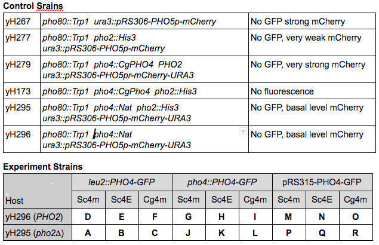
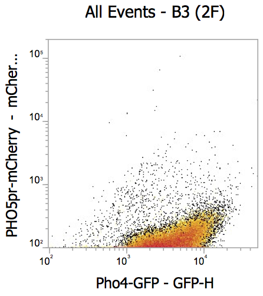
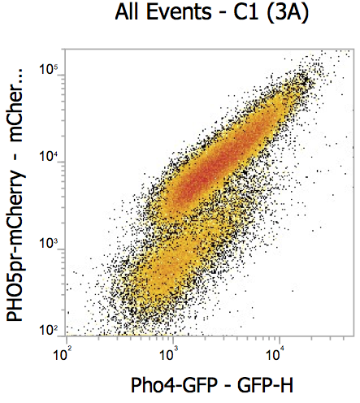
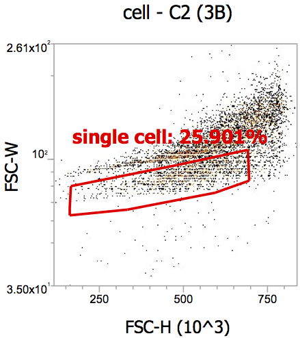
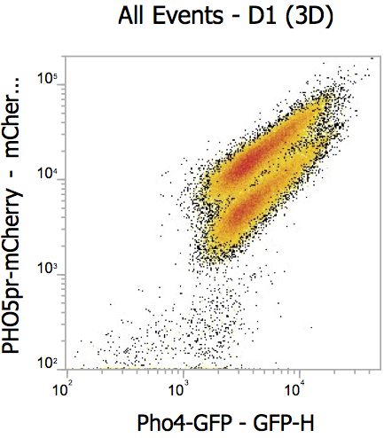
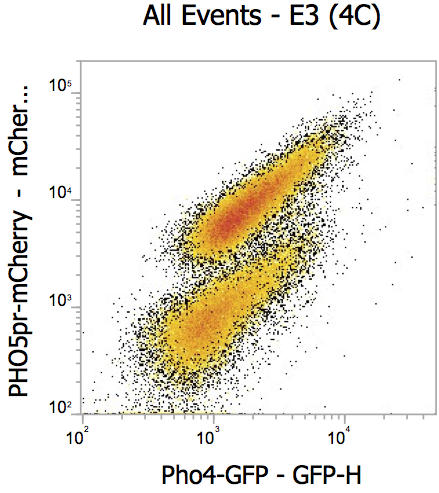
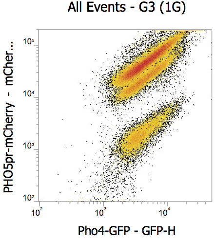

```{r setup, message=FALSE}
require(tidyverse)
require(cowplot)
```

## Goal

This is to repeat the 2020-12-21 experiment.

## Material and methods

See gDoc. This time I reverted to one o/n growth. The second growth was done in the 96-well clear plate (not deep well). Cells were directly diluted into PBS and run on the flow cytometer.

### Table of strains


## Data and analysis
### Import data
```{r}
#dat <- read_csv("20201223-Pho4-GFP-stats.csv")
#dat <- dat %>% mutate(Pho4GFP = factor(Pho4GFP, levels = c("No-GFP","ScPho4-mNeon","ScPho4-EGFP", "CgPho4-mNeon")), Group = factor(Group, levels = c("control", "endogenous", "exogenous", "plasmid")), Pho4 = factor(Pho4, levels = c("pho4-","ScPho4", "CgPho4"))) %>% filter(Sample != "G2") # remove G2 as it most likely had multiple PHO5pr-mCherry integrated and causes the rest of the RFP data to be compressed

dat <- read_tsv("./20201223-gated-median-out.txt", col_types = cols()) %>% 
  rename(Sample = name) %>%
  relocate(Sample) %>% 
  # remove G2 as it most likely had multiple PHO5pr-mCherry integrated and 
  # causes the rest of the RFP data to be compressed
  filter(Sample != "G2")
dat <- mutate(
  dat,
  Pho4GFP = factor(Pho4GFP, 
                   levels = c("No-GFP","ScPho4-mNeon","ScPho4-EGFP", "CgPho4-mNeon")), 
  Group = factor(Group, 
                 levels = c("control", "endogenous", "exogenous", "plasmid"),
                 labels = c("no GFP", "pho4::Pho4-GFP", "leu2::Pho4-GFP", "plasmid"))
)
issues <- c("G3","B3","C1","C2","D1","E3") # see below for reasons
```

Looking at the detailed plots, I identified a few samples that are problematic.

| | | | |
|:--:|:--:|:--:|:--:|
| lack _PHO5pr-mCherry_ | two populations | too few cells collected |
|  |  |  |
| two populations | two populations | two populations |
|  |  |  |
 
> In the FlowCore analysis, I now fixed some of them using a cluster gate.
> C1, D1 and E3 should now represent a homogenous population.

### Pho4-GFP expression levels
First look at the level of Pho4-GFP compared with the negative controls.
```{r, echo = F, fig.height = 6, fig.width = 6}
gfp.bg <- dat %>% filter(Pho4GFP == "No-GFP") %>% pull(BL1.H) %>% mean()
p1 <- dat %>% 
  mutate(Sample = ifelse(PHO2 == "pho2-", paste("*", Sample), Sample)) %>%
  ggplot(aes(x = Sample, y = BL1.H, fill =  Group)) + 
  geom_bar(stat = "identity", position = position_dodge2(width = 0.9)) +
  geom_hline(yintercept = gfp.bg, linetype = "dashed", alpha = 0.6) +
  facet_grid(Pho4GFP~., scales = "free_y", space = "free_y") +
  scale_fill_brewer("Pho4-GFP source", type = "div", drop = FALSE) + 
  scale_y_continuous(limits = c(0,NA), expand = c(0.01,0)) +
  coord_flip() + 
  theme_bw() +
  labs(title = "GFP fluorescent intensity (arbitrary units)", 
       subtitle = "dashed line indicates background fluorescence", 
       x = "Sample (* = pho2-)",
       y = "GFP Intensity (a.u.)")

p1
ggsave("img/20201223-Pho4-GFP-levels.png", width = 5, height = 6)
```
**Figure 1 Pho4-GFP intensity by strain.** Pho4-GFP intensities were quantified on an Attune NxT flow cytometer using 400 mV on the BL1 channel. Acquisition rate is 200 ul/min. At least 10,000 events were collected and the median fluorescent intensity (MFI, arbitrary units) were presented on the x-axis, while strain IDs are listed on the vertical axis. An asterisk next to a bar indicates issues found with the sample (see methods section for details).

_Discussion_

- Somewhat surprising to me, the exogenously integrated Pho4-GFP, except for the ScPho4-mNeon, seem to have rather low fluorescent intensity. For example, F1, E2 and E3 all have very low GFP signals.
- Last time (see [2020-12-21 report](https://rpubs.com/emptyhb/Pho4-GFP-test-20201221)) I observed higher ScPho4-mNeon and ScPho4-EGFP expression in the yH295 background (P, Q) than in the yH296 background (M, N). I suspected there may be some feedback due to the lack of Pho2. This time however, their expression levels appear to be the same. The main difference in the experimental protocol compared to the last time is that I did one o/n growth before the final growth instead of two.

### PHO5pr-mCherry reporter levels
```{r, fig.height = 7, fig.width = 7}
#rfp.bg <- mean(dat %>% filter(!PHO5RFP) %>% pull(YL2.H))
# didn't include a negative control for no RFP. from preivous runs, we know'
# the background for RFP is extremely low (~100), and thus can be safely ignored
rfp.basal <- dat %>% filter(Sample %in% c("yH295", "yH296")) %>% pull(YL2.H) %>% mean()

# removed a few outliers with MFI > 20k
p2 <- dat %>% #filter(PHO5RFP) %>% 
  select(Sample, Group, Pho4GFP, PHO2, BL1.H, YL2.H) %>% 
  pivot_longer(cols = c(BL1.H, YL2.H),
               names_to = "Parameter", values_to = "Median") %>% 
  mutate(Parameter = factor(Parameter, levels = c("BL1.H", "YL2.H"), 
                            labels = c("Pho4-GFP", "PHO5-RFP")),
         Sample = ifelse(PHO2 == "pho2-", paste("*", Sample), Sample)) %>%
  ggplot(aes(x = Sample, y = Median, fill =  Group)) + 
  geom_bar(stat = "identity", position = position_dodge2(width = 0.9)) +
  geom_hline(aes(yintercept = ifelse(Parameter == "Pho4-GFP", gfp.bg, rfp.basal)), linetype = 2, alpha = 0.6) +
  facet_grid(Pho4GFP ~ Parameter, scales = "free", space = "free_y") + 
  xlab("Sample (* = pho2-)") + ylab("Median Fluorescent Intensity (a.u.)") +
  scale_fill_brewer("Pho4-GFP source", type = "div", drop = FALSE) + #scale_color_manual(values = c("red", NA)) +
  coord_flip() + scale_y_continuous(expand = c(0.01,0.02)) +
  theme_bw()
p2
ggsave("img/20201223-Pho4-GFP-PHO5RFP-levels.png", width = 6, height = 6)
```
**Figure 2 Corresponding Pho4-GFP and PHO5pr-mCherry reporter fluorescence intensity per strain.** Pho4-GFP and PHO5p-mCherry intensities were quantified on an Attune NxT flow cytometer using 400 mV on the BL1 and 430 mV on the YL2 channels respectively. Acquisition rate is 200 ul/min. At least 10,000 events were collected. Strain IDs are listed on the vertical axis and the Median Fluorescent Intensity (MFI, arbitury units) for each channel on the horizontal axis. An asterisk next to a bar indicates an overnight growth instead of a mid-log phase growth was used for quantification. The dashed vertical line for Pho4-GFP indicates the autofluorescence as calculated by the mean of the intensities in the strains without GFP; the dashed vertical line for the RFP plot indicates the basal level expression from the reporter without Pho4, calculated by the average of yH295 and yH296, both of which lack Pho4 but has the reporter). An asterisk next to a bar indicates issues found with the sample (see methods section for details).

_Discussion_

- This experiment showed a lot of variability among the biological replicates, especially for exogenously integrated CgPho4 (C and F). This wasn't the case in my previous experiment. It will be useful to repeat this again.
- yH267 doesn't conform to my expectation -- it has ScPho4 and ScPho2 as well as the _PHO5pr-mCherry_ reporter, and thus should give normal levels of RFP, but didn't.

### _PHO5pr-mCherry_ induction levels normalized by Pho4 abundance
We will first transform the raw GFP and RFP intensities to make them more interpretable. For the GFP intensity, as there is a substantial background, we will subtract the background from all the GFP-containing strains to obtain the meaningful measure for Pho4 protein levels. For RFP, there is minimal background (see below). However, there is a "basal" expression of the reporter in the absence of Pho4 -- what we are interested in is not the absolute level of reporter expression but the fold induction compared with the _pho4∆_ strains.
```{r transform}
# transform
dat1 <- dat %>%
  # remove the control groups as we need to calculate R/G
  filter(Group != "no GFP") %>% 
  mutate(#GFP.noBG = ifelse(Pho4GFP == "No-GFP", NA, `Pho4-GFP` - gfp.bg),
    #RFP.noBG = ifelse(PHO5RFP, `PHO5pr-mCherry` - rfp.bg, 0),
    #RFP.FC = ifelse(PHO5RFP, RFP.noBG / rfp.basal, NA),
    #nRFP.FC = RFP.FC / GFP.noBG * median(GFP.noBG, na.rm = T))
    GFP.noBG = BL1.H - gfp.bg,
    GFP.noBG = ifelse(GFP.noBG > 0, GFP.noBG, NA),
    RFP.noBG = YL2.H, # - rfp.bg,
    RFP.FC = RFP.noBG / rfp.basal,
    RvG = RFP.noBG / GFP.noBG
  )
```

```{r plot_normalized_induction, fig.height = 7, fig.width=10, warning=FALSE}
p3 <- dat1 %>% 
  mutate(GFP.noBG = GFP.noBG / 1000, RFP.noBG = RFP.noBG / 1000) %>% 
  pivot_longer(cols = c(GFP.noBG, RFP.noBG), names_to = "Parameter", values_to = "Value") %>%
  mutate(Parameter = factor(Parameter, levels = c("GFP.noBG", "RFP.noBG"),  
                            labels = c("Pho4-GFP noBG", "PHO5pr-RFP noBG")),
         Sample = ifelse(PHO2 == "pho2-", paste("*", Sample), Sample)) %>% 
  ggplot(aes(x = Sample, y = Value, fill =  Group)) + 
  geom_bar(stat = "identity", position = position_dodge2(width = 0.9)) +
  geom_text(aes(label = ifelse(Sample %in% issues, "*", ""), hjust = -0.2, vjust = 0.8), color = "black", size = 5) +
  facet_grid(Pho4GFP ~ Parameter, scales = "free", space = "free_y") +
  scale_fill_brewer("Pho4-GFP source", type = "div", drop = FALSE) + 
  scale_color_manual(values = c("red", NA)) +
  coord_flip() + scale_y_continuous(expand = c(0.01,0.02)) + 
  xlab("Sample (* = pho2-)") + 
  ylab("Median Fluorescent Intensity (-backgroundd)") +
  theme_bw()
  
p4 <- dat1 %>% 
  pivot_longer(cols = c(RFP.FC, RvG), names_to = "Parameter", values_to = "Value") %>%
  mutate(Parameter = factor(Parameter, levels = c("RFP.FC", "RvG"), 
                            labels = c("PHO5 fold induction", "PHO5-RFP / Pho4-GFP")),
         Sample = ifelse(PHO2 == "pho2-", paste("*", Sample), Sample)) %>% 
  ggplot(aes(x = Sample, y = Value, fill =  Group)) + 
  geom_bar(stat = "identity", position = position_dodge2(width = 0.9)) +
  geom_hline(yintercept = 1, linetype = 2) +
  geom_text(aes(label = ifelse(Sample %in% issues, "*", ""), hjust = -0.2, vjust = 0.8), color = "black", size = 5) +
  facet_grid(Pho4GFP ~ Parameter, scales = "free", space = "free_y") +
  scale_fill_brewer("Pho4-GFP source", type = "div", drop = F) + #scale_color_manual(values = c("red", NA)) +
  coord_flip() + scale_y_continuous(expand = c(0.01,0.02)) + 
  ylab(NULL) + xlab("") +
  theme_bw()

## place shared legend at the bottom
## reference: https://wilkelab.org/cowplot/articles/shared_legends.html
legend <- get_legend(
  p1 + 
  guides(color = guide_legend(nrow = 1), fill = guide_legend(nrow = 1)) +
  theme(legend.position = "bottom")
)
prow <- plot_grid(
  p3 + theme(legend.position="none"),
  p4 + theme(legend.position="none"),
  align = 'vh',
  labels = c("A", "B", "C"),
  hjust = -1,
  nrow = 1
)
plot_grid(prow, legend, ncol = 1, rel_heights = c(1, .1))
```
**Figure 3 Composite plot including Pho4 abundance, _PHO5_ reporter strength and fold induction values.** Pho4-GFP and PHO5p-mCherry intensities were quantified as defined above. Strain IDs are listed on the vertical axis. In **(A)**, the x-axis values represent the Median Fluorescent Intensity (MFI, arbitury units) for either Pho4-GFP or PHO5pr-mCherry. For Pho4-GFP, the background level based on strains without Pho4-GFP was subtracted. No background subtraction was done for mCherry, but past results suggest that the background fluorescence is neglegible relative to the positive strains. In **(B)**, the fold change for _PHO5_ reporter is calculated as the background-subtracted RFP level divided by the basal expression level, as measured by the mean of the two strains containing the reporter but have _pho4∆_. The normalized induction ratio on the right column is calculated by dividing the induction fold change from the left column by the corresponding Pho4-GFP (background subtracted) levels and multiplied by the median Pho4-GFP levels of all strains. The dashed lines in both columns indicate the induction fold change of 1, i.e. no change compared to the _pho4∆_ strains. In both panels, the x-axes are square-root transformed so as to bring outliers into the plot without compressing the rest of the data range. An asterisk next to a bar indicates an overnight growth instead of a mid-log phase growth was used for quantification. An asterisk next to a bar indicates issues found with the sample (see methods section for details).

_Discussion_

- Plasmid-born Pho4-GFP strains show more variability in Pho4 abundance, but yields quite consistent fold induction values after normalizing by the GFP intensity. Some issues do exist, e.g. Q1, Q2. B2 and B4's abnormally high induction after normalization is due to the very low GFP intensity.
- The exogenously integrated strains show more variability, likely due to two reasons: multiple-integration at the time of transformation and spontaneous loop-out leading to loss of the extra copies during the outgrowth (or even on the plates)
- Based on limited data, the endogenously integrated Pho4-GFP has the lowest clone-to-clone variability. If we could make the reporter construct also endogenous, we would expect highly reproducible data.

### Plot variations
Present the above plot in a different way.
```{r plot_variation, fig.height = 5, fig.width=6}
pd <- position_dodge(0.9)
tmp <- bind_rows(
  "Pho4-GFP (MFI)" = select(dat, Sample, Group, Pho4GFP, PHO2, Value = BL1.H),
  "PHO5-RFP / Pho4-GFP" = select(dat1, Sample, Group, Pho4GFP, PHO2, Value = RvG),
  .id = "Parameter"
)
p5 <- tmp %>% 
  ggplot(aes(x = PHO2, y = Value, group = Group)) + 
  stat_summary(aes(fill = Group), geom = "crossbar", 
               fun.data = "mean_sdl", fun.args = list(mult = 1), 
               position = pd, linewidth = 0.2, width = 0.5) +
  geom_point(shape = 21, size = 1, position = pd, color = "gray20", fill = "white") +
  #geom_hline(yintercept = gfp.bg, linetype = "dashed", alpha = 0.6) +
  facet_grid(Pho4GFP ~ Parameter, scales = "free", space = "free_y") +
  scale_fill_brewer("Pho4-GFP source", type = "div", drop = FALSE,
                    breaks = c("no GFP", "leu2::Pho4-GFP", "plasmid")) + 
  #scale_y_continuous(limits = c(0,NA), expand = c(0.01,0)) +
  coord_flip() +  theme_bw() +
  theme(axis.title = element_blank(), legend.position = "top")
p5
ggsave("img/20201223-Pho4-GFP-RvG-crossbar.png", width = 5, height = 6)
```
**Figure 4 Variability in Pho4-GFP intensity and normalized PHO5RFP levels between plasmids and integrated Pho4** The same definitions for the two values as above. Here, the different biological replicates are plotted as dots. The crossbar shows the mean (middle line) and standard deviation (box).

_Discussions_

- It's clear that plasmid-born Pho4 has smaller biological variation than exogenously integrated ones.

## Conclusion
- If CRISPR can boost the gene editing efficiency, prefers the endogenous method.
- Plasmid is a viable approach for 1) quickly assessing the phenotypes of the constructs and 2) a backup should the endogenous approach encounter technical difficulties.