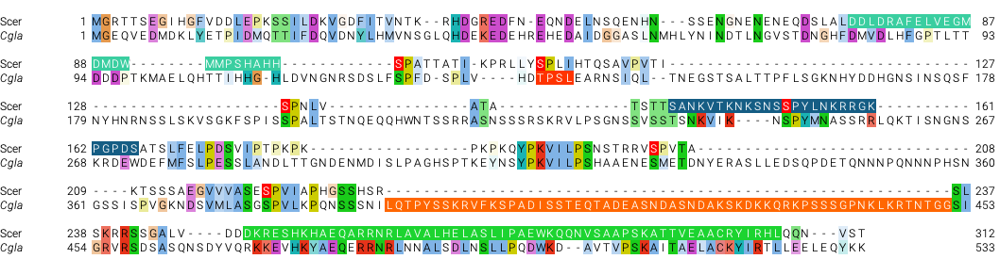

One reviewer made a comment as follows:

>  It seems to me that the authors map the ‘auto-inhibitory’ region to the P2ID region next to the DBD. However, the mechanism for how this works doesn’t seem to be explored. Does the P2ID prevent binding of the DBD in the absence of Pho2 or does it block the activation domains? One of the striking thing about this P2ID region in CgPho4 is that it is severely elongated. This deletion in ScPho4 removes a potential basic-rich IDR (usually nuclear localization signals but here it could be something else), but more importantly moves the Pho85 motif very close to the DBD. This Pho85 motif is known to control the Pho4-Pho2 interaction, so we can presume that Pho2 binds to that section. Based on this, it is possible that the P2ID of ScPho4 blocks the DBD in the absence of Pho2. Can’t the authors show this?

This is a reasonable idea and we decided to test it by constructing two additional chimeras. The design is based on the alignment of the two proteins as shown below (part)

In the figure above, the orange highlighted region is one of three indels between the two Pho4 orthologs in the P2ID region. It is the longest and closest to the DBD. We (Lindsey) reasoned baesd on the above hypothesis that by inserting this sequence into ScPho4 at the corresponding region (essentially copy-n-paste the sequence into the top row of ScPho4) between aa 235 and 236 (ScPho4 position), we expect to rescue ScPho4's activity without Pho2. In a second design, the CgPho4 sequence was replaced with an equal length of GS flexible linker. The exact sequence designs are shown below:

plsmid | makeup
-------|-------
 pH481 | Sc(1-235) Cg(392-451) Sc(236-312)
 pH482 | Sc(1-235) (GS)x30 Sc(236-312)

**Note**: there is another analysis also focusing on the P2ID, where we tested whether P2ID:Sc is required for the function of DBD:Sc. That analysis is together with the main chimera set analysis. Link: [Sc45ext analysis](../03-flow-full-data-lfs/analysis/20240208-Sc45-Cg4ext-pool-n-analyze.Rmd)
