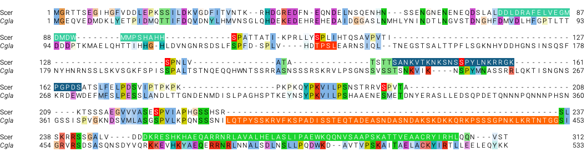

```{r message=FALSE}
#require(plotly)
require(tidyverse)
require(ggridges)
require(cowplot)
require(ggtext)
#require(RColorBrewer)
```

```{r}
old <- theme_set(theme_bw(base_size = 16))
```

# Background

One reviewer made a comment as follows:

>  It seems to me that the authors map the ‘auto-inhibitory’ region to the P2ID region next to the DBD. However, the mechanism for how this works doesn’t seem to be explored. Does the P2ID prevent binding of the DBD in the absence of Pho2 or does it block the activation domains? One of the striking thing about this P2ID region in CgPho4 is that it is severely elongated. This deletion in ScPho4 removes a potential basic-rich IDR (usually nuclear localization signals but here it could be something else), but more importantly moves the Pho85 motif very close to the DBD. This Pho85 motif is known to control the Pho4-Pho2 interaction, so we can presume that Pho2 binds to that section. Based on this, it is possible that the P2ID of ScPho4 blocks the DBD in the absence of Pho2. Can’t the authors show this?

This is a reasonable idea and we decided to test it by constructing two additional chimeras. The design is based on the alignment of the two proteins as shown below (part)



In the figure above, the orange highlighted region is one of three indels between the two Pho4 orthologs in the P2ID region. It is the longest and closest to the DBD. We (Lindsey) reasoned baesd on the above hypothesis that by inserting this sequence into ScPho4 at the corresponding region (essentially copy-n-paste the sequence into the top row of ScPho4) between aa 235 and 236 (ScPho4 position), we expect to rescue ScPho4's activity without Pho2. In a second design, the CgPho4 sequence was replaced with an equal length of GS flexible linker. The exact sequence designs are shown below:

# Design and Data Acquisition
plsmid | makeup
-------|-------
 pH481 | Sc(1-235) Cg(392-451) Sc(236-312)
 pH482 | Sc(1-235) (GS)x30 Sc(236-312)

Lindsey and Emily designed the above plasmids. Emily constructed the plasmids and collected the flow data 2024.11.21. The data are processed using the onboard Attune software and saved in the `../input/` folder.

# Import data

```{r}
# read in sample information
sample <- read_tsv("../input/20241121-ScPho4-extended-P2ID-makeup.txt",
                   # this tells the function that it should expect two character columns
                   col_types = "ccc", 
                   # this is to ensure if there are no values in some cell in the 
                   # spreadsheet file, they will be translated to NA 
                   na = character()) %>% 
  # this is to change the name and group into vectors. optional
  mutate(name = fct_inorder(name))

# read in the raw data
raw <- read_csv("../input/20241121-EO-extended-P2ID-export.csv", na = c("N/A", ""))

# transform the raw data
dat0 <- raw %>% 
  # retain only the columns we need, and rename them for easy manipulation
  select(sample = Sample, gate = Gate, par = `X Parameter`,
         count = Count, median = `X Median`) %>% 
  # remove bead controls
  filter(sample != "beads") %>% 
  # filter by X Parameter and gates
  # we will retain both R1 and R3 gated cells for later experimenting
  filter(gate == "R1", 
         par %in% c("Pho4-GFP - BL1-H", "PHO5pr-mCherry - YL2-H")) %>% 
  select(-gate) %>% 
  # here, we separate the sample name into its constituent parts by "-":
  # 1. plasmid name; 2: host name; 3: replicate name
  separate(sample, into = c("plasmid", "host", "rep"), sep = "-") %>% 
  # rename the host levels
  mutate(host = fct_recode(host, PHO2 = "555", pho2 = "373", noRFP = "156"),
         par = fct_recode(par, Pho4GFP = "Pho4-GFP - BL1-H",
                          PHO5pRFP = "PHO5pr-mCherry - YL2-H")) %>% 
  # here, we annotate the raw data by merging it with the sample information
  # sheet, joining on the common column, i.e., plasmid
  left_join(sample, by = "plasmid")
```

# Analysis
## 1. QC
Blank wells
```{r}
dat0 %>% filter(host == "blank")
```
> blank wells have very few events passing the cell gate, probably carryover

No RFP control and host strains with no Pho4 plasmids
```{r}
dat0 %>% filter(plasmid == "NA", host != "blank") %>% 
  pivot_wider(names_from = "par", values_from = median) %>% 
  arrange(host) %>% select(-rep, -name, -makeup)
```

> there are some baseline expression from the reporter

How many events were there?

```{r}
dat0 %>% filter(host != "blank") %>% pull(count) %>% table()
```

> Emily ensured that all samples have exactly 10,000 events

Transform the dataset for background subtraction
```{r}
tmp <- filter(dat0, host != "blank") %>% 
  # no need for the count variable
  select(-count) %>% 
  # label the host controls as "no Pho4"
  mutate(name = fct_na_value_to_level(name, "no Pho4")) %>% 
  # pivot wider
  pivot_wider(names_from = par, values_from = median)
```

## 2. Background subtraction

Check the background fluorescence levels
```{r}
tmp %>% filter(plasmid == "NA") %>% select(-name, -makeup) %>% arrange(host)
```

Subtract the background.
- I'll use the mean of the no Pho4 samples as the background for Pho4-GFP
- I'll group the samples based on their host, and subtract the no Pho4 host strain's RFP levels

```{r}
bg.gfp <- tmp |> filter(plasmid == "NA") |> pull(Pho4GFP) |> mean() |> round(0)
dat <- tmp %>% 
  # remove the noRFP host samples
  filter(host != "noRFP") %>% 
  # subtract GFP background
  mutate(Pho4GFP = Pho4GFP - bg.gfp) %>% 
  # group by hosts for RFP background subtraction
  group_by(host) %>% 
  mutate(
    PHO5pRFP = PHO5pRFP - mean(PHO5pRFP[plasmid == "NA"]),
    A = PHO5pRFP / Pho4GFP
  ) %>% 
  # now remove the host
  filter(plasmid != "NA")
```

## 3. Compare P2ID extention to endogenous Pho4's

The rationale of this experiment is to test whether distancing P2ID:Sc from DBD:Sc will enhance its activity without Pho2 (reduce the autoinhibitory effect).

```{r}
# set the host colors
host.colors <- c("PHO2" = "gray50", "pho2" = "orange", "pho2*" = "orange3", 
                 "blank" = "gray90")

# set plotting position for bar plots
pd = position_dodge(0.9)

# plot design
my_plot_design <- list(
  geom_bar(aes(fill = host), width = 0.75,
           stat = "summary", fun = "mean", position = pd),
  stat_summary(fun.data = "mean_sdl", fun.args = list(mult = 1), 
              geom = "linerange", color = "gray30", linewidth = 0.5,
              position = pd),
  #geom_point(aes(color = date), position = pd, size = 0.75),
  scale_x_discrete(limits = rev),
  coord_flip(),
  scale_fill_manual(values = host.colors),
  scale_color_brewer(palette = "Set1"),
  ylab("Normalized activity"),
  xlab(NULL),
  theme_cowplot(),
  panel_border(color = "gray20", size = 1.2),
  background_grid(major = "x", minor = "x"),
  theme(
    axis.line = element_blank(),
    legend.text = element_text(face = 3),
    legend.position = "top"
  )
)
p0 <- dat %>% 
  ggplot(aes(x = name, y = A, group = host)) + my_plot_design +
  geom_point(position = pd, size = 0.75)
p0
ggsave("../output/20241208-P2ID-extension-effect.png", width = 5, height = 3)
```
> Clearly neither insertion reduced the level of Pho2-dependence of ScPho4
```{r}
dat1 <- bg.rm %>% 
  filter(plasmid != "NA", host != "noRFP", flag == "pass") %>% 
  mutate(host = fct_recode(host, pho2 = "pho2∆"))

datsum <- dat1 %>%
  group_by(plasmid, host) %>% 
  summarize(
     n = n(),
    mG = mean(BL1.H),
    mR = mean(YL2.H),
     A = mean(YL2.H/BL1.H),
     r = mR/mG,
    s2 = 1/(n-1)*sum((YL2.H - r*BL1.H)^2),
    vr = 1/(mG^2)*s2/n,
    se = sqrt(vr),
    .groups = "drop"
  ) %>% 
  select(-s2, -r, -vr)

# for plotting individual data points
dat_sep <- dat1 %>%
  filter(!is.na(plasmid)) %>% 
  mutate(A = YL2.H/BL1.H) %>% 
  select(plasmid, host, BL1.H, YL2.H, A, flag) %>% 
  left_join(select(meta, plasmid, set, symbol), by = "plasmid")# %>% 
  #mutate(symbol = fct_reorder(symbol, rA_PHO2, .desc = TRUE))# %>% 
```

... merge the data for plotting
```{r}
ximera <- datsum %>%
  pivot_wider(id_cols = plasmid, names_from = host,
              values_from = c(A, se)) %>% 
  mutate(
    rA_PHO2 = A_PHO2 / A_PHO2[plasmid == "194"],
    rA_pho2 = A_pho2 / A_pho2[plasmid == "194"],
    boost = A_PHO2 / A_pho2,
    group = case_when(
      plasmid %in% c("188", "194") ~ "ref",
      rA_PHO2 < 0.2                ~ "n.f.",
      .default = "chimera"
    ),
    group = fct_relevel(group, "ref", "chimera", "n.f.")
  ) %>% 
  left_join(select(meta, plasmid, set, symbol), by = "plasmid") %>% 
  mutate(symbol = fct_reorder(symbol, rA_PHO2, .desc = TRUE)) %>% 
  relocate(c(set, symbol, group), .after = plasmid)
```

Export the summarized data
```{r}
write_tsv(ximera, file = "../output/20240212-Sc45-Cg4ext-chimera-summarized.tsv")
```

... source the plotting functions
```{r}
source("../script/20240211-chimera-data-plotting-functions.R")
```

Plotting the results
```{r, fig.width=8}
tmp <- ximera %>% 
  select(plasmid, symbol, group) %>% 
  inner_join(dat1, by = "plasmid") %>% 
  mutate(symbol = fct_relevel(symbol, sort),
         group = fct_recode(group, chimera = "n.f.")
         )
my_symbol_colors <- function(symbols){
  colored.symbols <- gsub("W", "<span style='color:red'>W</span>", symbols) %>% 
    gsub("Y", "<span style='color:blue'>Y</span>", .)
  return(colored.symbols)
}
my_plot_components(tmp) + 
  scale_x_discrete(labels = my_symbol_colors) +
  theme(axis.text.x = element_markdown(angle = 45, hjust = 1),
        axis.line = element_blank())

ggsave("../img/20240212-Sc45-Cg4ext-test-components.png", width = 8, height = 5)
```
> 1. Replacing DBD:Sc with the combination of P2ID+DBD:Sc rescued the activity with Pho2. This suggests that even though DBD:Sc have binding capabilities _in vitro_ and _in vivo_, its function in the context of the full TF protein requires P2ID:Sc and the presence of Pho2.
> 
>    It is worth noting that some of the chimeras exceeded the activity of both ScPho4 and CgPho4.
> 
> 2. There is very little change in the activity without Pho2. This is again consistent with the interpretation above, i.e., for full functionality of the TF, il faut le trio: P2ID:Sc + DBD:Sc + Pho2
>
> 3. Lindsey also tested if extending P2ID:Cg to a.a. 470 makes any difference. The answer is no.

Use a different way of visualization for the figures
```{r}
my_plot_subset_ximera <- function(symbols){
  # this function plots a subset of the chimeras as horizontal bar plots
  # showing the Rel. A_PHO2 and %A_pho2∆ values
  # it takes as input a vector containing the symbols for the chimeras for 
  # plotting. the order in the vector determines the plot order
  # the endogenous ScPho4 and CgPho4 are implied
  missing <- setdiff(symbols, ximera$symbol)
  if(length(missing) != 0)
    stop(paste(missing, "are not found", sep = " "))
  
  tmp <- filter(ximera, symbol %in% c("SSSSS", "CCCCC", symbols)) %>% 
    mutate(
      rSE_PHO2 = se_PHO2 / A_PHO2[symbol == "SSSSS"],
      rSE_pho2 = se_pho2 / A_pho2[symbol == "SSSSS"]
    ) %>% 
    pivot_longer(cols = c(rA_PHO2, rA_pho2, rSE_PHO2, rSE_pho2), 
                 names_to = c(".value", "parameter"), names_sep = "_",
                 values_to = "value") %>% 
    mutate(parameter = fct_relevel(parameter, "PHO2"),
           symbol = factor(symbol, levels = 
                             unique(c("SSSSS", "CCCCC", symbols)))) %>% 
  select(-c(A_PHO2:boost))
    
  # labeller
  par.explain <- c(
    PHO2 = "Rel. A<sub>PHO2</sub>",
    #boost = "Boost",
    pho2 = "Rel. A<sub>pho2∆</sub>"
  )
  
  p <- ggplot(tmp, aes(y = symbol, x = rA)) +
    geom_col(width = 0.5, color = "black", fill = "gray80") +
    geom_vline(xintercept = 1, linetype = 2, color = "gray30") +
    geom_errorbar(aes(xmin = rA - rSE, xmax = rA + rSE), width = 0.2) +
    facet_wrap(~parameter, scales = "free_x",# switch = "x",
              labeller = labeller(parameter = par.explain)) +
    scale_y_discrete(limits = rev) + 
    scale_x_continuous(expand = expansion(mult = c(0.02, 0.05))) +
    theme_cowplot() + panel_border(color = "gray30") +
    background_grid(major = "y", minor = "none") +
    theme(axis.text.y = element_text(family = "courier"),
          axis.title = element_blank(),
          axis.line = element_blank(),
          strip.placement = "outside",
          strip.background = element_blank(),
          strip.text = element_markdown())
  return(p)
}
```

An alternative design: no relative activity to ScPho4, and individual data points plotted
```{r}
my_plot_subset_ximera_alt <- function(symbols){
  # this function plots a subset of the chimeras as horizontal bar plots
  # showing the Rel. A_PHO2 and %A_pho2∆ values
  # it takes as input a vector containing the symbols for the chimeras for 
  # plotting. the order in the vector determines the plot order
  # the endogenous ScPho4 and CgPho4 are implied
  missing <- setdiff(symbols, ximera$symbol)
  if(length(missing) != 0)
    stop(paste(missing, "are not found", sep = " "))
  
  tmp <- filter(dat_sep, symbol %in% c("SSSSS", "CCCCC", symbols)) %>% 
    mutate(host = fct_relevel(host, "PHO2"),
           symbol = factor(symbol, levels = 
                             unique(c("SSSSS", "CCCCC", symbols))))

  tmp %>% count(symbol, host) %>% print()
  # labeller
  par.explain <- c(
    PHO2 = "A<sub>PHO2</sub>",
    #boost = "Boost",
    pho2 = "A<sub>pho2∆</sub>"
  )
  
  p <- ggplot(tmp, aes(y = symbol, x = A)) +
    geom_bar(stat = "summary", fun = "mean", 
             width = 0.5, color = "black", fill = "gray80") +
    stat_summary(fun.data = "mean_cl_boot", geom = "linerange",
                 color = "steelblue4") +
    geom_point(data = filter(tmp, !symbol %in% c("CCCCC", "SSSSS")), 
               size = 0.6, shape = 3, color = "gray30") +
    #geom_vline(xintercept = 1, linetype = 2, color = "gray30") +
    #geom_errorbar(aes(xmin = rA - rSE, xmax = rA + rSE), width = 0.2) +
    facet_wrap(~host, scales = "free_x",# switch = "x",
              labeller = labeller(host = par.explain)) +
    scale_y_discrete(limits = rev) + 
    scale_x_continuous(expand = expansion(mult = c(0.02, 0.05))) +
    theme_cowplot() + panel_border(color = "gray30") +
    background_grid(major = "y", minor = "none") +
    theme(axis.text.y = element_text(family = "courier"),
          axis.title = element_blank(),
          axis.line = element_blank(),
          strip.placement = "outside",
          strip.background = element_blank(),
          strip.text = element_markdown())
  return(p)
}
```

```{r}
selected <- as.character(
  expression(SCCCS, CSCCS, CCSCS, SSCCS, SSSCS, 
             SCCCW, CSCCW, CCSCW, SSCCW, SSSCW))
#selected <- filter(meta, symbol %in% selected) %>% pull(plasmid)
my_plot_subset_ximera_alt(selected) +
  scale_y_discrete(limits = rev, labels = my_symbol_colors) +
  theme(axis.text.y = element_markdown())
ggsave("../img/20241130-Sc45ext-compare-rel-activity.png", width = 4, height = 4)
```
```
