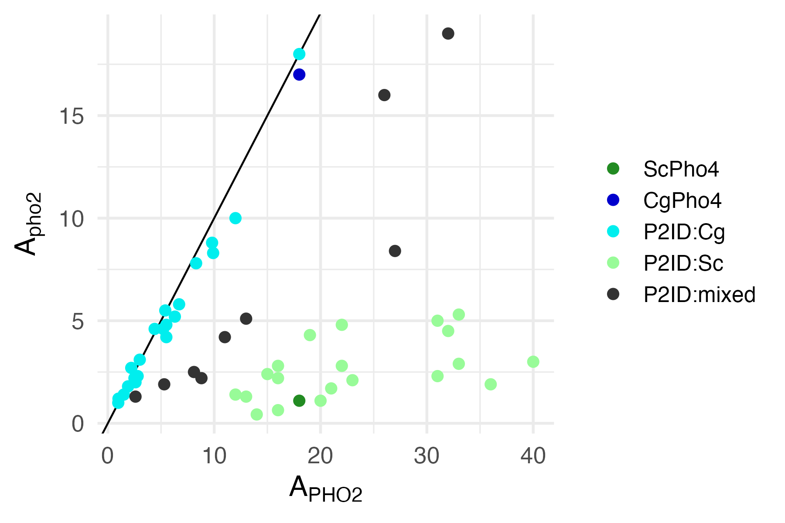

```{r message=FALSE}
require(plotly)
require(tidyverse)
require(ggridges)
require(cowplot)
require(RColorBrewer)
require(grid)
require(ggtext)
```

```{r}
old <- theme_set(theme_bw(base_size = 16))
```

This is the second part of the analysis. In the first part (see `../input/PHO5-data/20231019-pool-qc-PHO5.Rmd`), I did QC and exported the filtered dataset. Here, I will continue working with that dataset and answer our biological questions.

# Goal
- Analyze the full chimera set flow results for _PHO5pr_-mCherry reporter.
- Develop an analysis pipeline to perform QC, correction (if needed) and plotting the results.

# Data
Import the background subtracted data
```{r}
dat0 <- read_tsv("../input/20231023-PHO5-bg-subtracted-data.tsv", col_types = "ccccdddddc")
```

Filter the data
```{r}
dat <- filter(dat0, host != "PHO84", flag == "pass", date != "02/10") %>% 
  # based on previous QC, the following sample (both replicates) have high
  # variance - one biological replicate is highly expressed, while the other 
  # two have mNeon, but barely any RFP expression.
  mutate(
    host = fct_recode(host, pho2 = "pho2∆"),
    flag = ifelse(plasmid == "233" & host == "pho2", "high.var", flag))
```

Number of replicates left for each sample
```{r}
expt <- dat %>% 
  filter(host %in% c("PHO2", "pho2"), !plasmid %in% c("188", "194")) %>% 
  group_by(date, plasmid, host) %>% 
  summarize(n = n(), .groups = "drop")

expt %>% 
  ggplot(aes(x = plasmid, y = n)) +
  geom_col(aes(fill = host)) + 
  facet_grid(date ~ .) +
  scale_fill_manual(values = c("PHO2" = "gray30", "pho2" = "gray70")) +
  theme_minimal() + background_grid(major = "none") + panel_border(size = 0.5) +
  scale_y_continuous(name = "Replicates", breaks = c(6)) + xlab(NULL) +
  theme(axis.text.x = element_text(angle = 90),
        strip.text.y = element_text(angle = 0),
        legend.position = "top")
```

Chimera makeup information
```{r}
meta <- read_tsv("../input/20230208-chimera-Pho4-makeup.txt", col_types = "ccccc")
```

## Summarize data

Here we would like calculate the ratio of RFP/GFP for each chimera (plasmid) across all replicates, including from different days. Note that the parameter of interest is a ratio, which can be estimated using either "means of ratios" or "ratios of means". These are just two specific instances of a more general estimator, representing two choices of the weights. The "means of ratios" first calculates the ratios for each replicate within a plasmid, then average them. In this calculation, each replicate is given the weight of 1/n (equal). The "ratios of means" first sum up the GFP and RFP values separately across the replicates for each plasmid, then take the ratio between them. In this estimator, the weight for each replicate is x / sum(x), where x is the denominator in the ratio, i.e., GFP. In other words, this estimator will give more weights to the replicates where the chimera had a higher expression level.

Both estimators are known to be biased. We will ignore that for the moment. In terms of a choice between the two, it seems that there is no reason to give more weights to the experiments with a higher GFP signal. So, the "means of ratios" seems a more natural choice. However, we will calcultae both and dedice later.


A final question is how to calculate the variance of the ratio estimate. According to the `survey` package [manual](https://rstudio-pubs-static.s3.amazonaws.com/178965_fb60a0f7bbb44a6ea219713fb1a89a22.html), an approximate estimator for the variance is

$$
r = \frac{\bar{y}}{\bar{x}}, \text{where}\ \bar{y}=\frac{1}{n}\sum_{i=1}^{n}y_i\ \text{and}\ \bar{x}=\frac{1}{n}\sum_{i=1}^{n}x_i\ \\
\hat{V}(r) = (1-\frac{n}{N})(\frac{1}{\bar{x}^2})\frac{s_r^2}{n}\ \text{where}\ s_r^2=\frac{1}{n-1}\sum_{i=1}^{n}(y_i-rx_i)^2
$$

Assuming that N>>n, we can ignore the first term in the variance estimator. The rest can be calculated from the data

```{r}
datsum <- dat %>%
  filter(!is.na(plasmid)) %>% 
  group_by(plasmid, host) %>% 
  summarize(
     n = n(),
    mG = mean(BL1.H),
    mR = mean(YL2.H),
     A = mean(YL2.H/BL1.H),
     r = mR/mG,
    s2 = 1/(n-1)*sum((YL2.H - r*BL1.H)^2),
    vr = 1/(mG^2)*s2/n,
    se = sqrt(vr),
    .groups = "drop"
  ) %>% 
  select(-s2, -r, -vr)# %>% 
  #pivot_wider(names_from = host, values_from = BL1.H:`nR/G`) %>% 
  #mutate(`pho2∆/PHO2` = `R/G_pho2∆`/`R/G_PHO2`,
  #       `n.pho2∆/PHO2` = `nR/G_pho2∆`/`nR/G_PHO2`)
```

For each chimera, we would also like to calculate **three values**:

1. A in _pho2∆_: this is its base activity without Pho2
1. A in _PHO2_: this is its full activity with Pho2
1. A_PHO2 / A_pho2∆: this is the Pho2 enhancement of activity

We assign the chimeras into several groups, based on their A_PHO2 and A_PHO2/A_pho2∆

```{r}
ximera <- datsum %>%
  pivot_wider(id_cols = plasmid, names_from = host,
              values_from = c(A, se)) %>% 
  mutate(
    rA_PHO2 = A_PHO2 / A_PHO2[plasmid == "194"],
    rA_pho2 = A_pho2 / A_pho2[plasmid == "194"],
    boost = A_PHO2 / A_pho2,
    group = case_when(
      plasmid %in% c("188", "194") ~ "ref",
      rA_PHO2 < 0.2                ~ "n.f.",
      .default = "chimera"
    ),
    group = fct_relevel(group, "ref", "chimera", "n.f.")
  ) %>% 
  left_join(select(meta, plasmid, set, symbol), by = "plasmid") %>% 
  mutate(symbol = fct_reorder(symbol, rA_PHO2, .desc = TRUE)) %>% 
  relocate(c(set, symbol, group), .after = plasmid)
```

Export the summarized data
```{r}
write_tsv(ximera, file = "../output/20231125-PHO5pr-chimera-summarized.tsv")
```

# Analysis
## Plotting functions
<!---
Set up common parameters for thresholding and plotting
```{r}
# reference Pho4 plasmid ids
refs <- c("188", "194")
# colors
date.colors = c(brewer.pal(name="Dark2", n = 8), brewer.pal(name="Paired", n = 8))
host.colors = c("PHO2" = "gray30", "pho2" = "gray70")
point.colors = c("PHO2" = "forestgreen", "pho2" = "purple4")
# 
```
--->

Source the scripts
```{r}
source("../script/20240211-chimera-data-plotting-functions.R")
```


Modify the component plotting function for special purposes
```{r}
my_plot_ratio <- function(selection){
  # custom colors for this function
  date.colors = c(brewer.pal(name="Dark2", n = 8), brewer.pal(name="Paired", n = 8))
  host.colors = c("PHO2" = "gray30", "pho2" = "gray70")
  point.colors = c("PHO2" = "forestgreen", "pho2" = "purple4")
  # prepare data
  tmp <- my_data_prep(selection)
  # plotting
  p <- tmp %>% 
    select(-c(FSC.H, nGFP, nRFP, flag)) %>% 
    mutate(`R/G` = YL2.H/BL1.H) %>% 
    pivot_longer(cols = c(BL1.H, YL2.H, `R/G`), 
                 names_to = "parameter", values_to = "value") %>% 
    mutate(parameter = factor(parameter, levels = c("R/G", "YL2.H", "BL1.H"),
                              labels = c("RFP/GFP", "PHO5pRFP", "Pho4-GFP"))) %>% 
    ggplot(aes(x = symbol, y = value, group = host)) + 
    stat_summary(aes(group = host), fun.data = "mean_cl_boot", geom = "errorbar",
                 position = position_dodge(0.5), width = 0.3) +
    geom_bar(aes(fill = host), width = 0.5, alpha = 0.8,
             stat = "summary", fun = "mean", position = position_dodge(0.5)) +
    geom_point(data = function(x) subset(x, !symbol %in% c("CCCCC", "SSSSS")),
               aes(group = host, color = date), size = 1, shape = 3, alpha = 0.9,
               position = position_jitterdodge(dodge.width = 0.5, jitter.width = 0.1)) +
    scale_color_manual(values = date.colors, guide = "none") +
    #geom_point(data = function(x) subset(x, !symbol %in% c("CCCCC", "SSSSS")),
    #           aes(group = host, color = host), size = 1, shape = 3, alpha = 0.9,
    #           position = position_jitterdodge(dodge.width = 0.5, jitter.width = 0.1)) +
    #scale_color_manual(values = point.colors) +
    scale_fill_manual(values = host.colors) +
    facet_grid(parameter~group, scales = "free", space = "free_x") +
    theme_bw(base_size = 18) + background_grid(minor = "none") + 
    xlab("Pho4 chimera") +
    theme(axis.text.x = element_text(angle = 30, hjust = 1, family = "mono"),
          legend.position = "top",
          axis.title = element_blank())
  return(p) 
}
```


<!--- replace with script file
```{r}
my_plot_boost <- function(selection){
  # given a selection of chimera IDs, plot their functionality w/PHO2
  # relative to ScPho4, and their boost
  # dat
  tmp <- filter(ximera, plasmid %in% c(refs, selection)) %>% 
    mutate(perc_pho2 = A_pho2/A_PHO2) %>% 
    pivot_longer(cols = c(s_PHO2, boost, perc_pho2), 
                 names_to = "parameter", values_to = "ratio")
  # labeller
  par.explain <- c(
    s_PHO2 = "Rel. A<sub>PHO2</sub>",
    boost = "Boost",
    perc_pho2 = "%A<sub>pho2</sub>"
  )
  p <- ggplot(tmp, aes(x = symbol, y = ratio)) +
    geom_col(width = 0.3, color = "black", fill = "gray80") +
    geom_hline(yintercept = 1, linetype = 2, color = "gray30") +
    facet_grid(parameter~group, scales = "free", space = "free_x",
              labeller = labeller(parameter = par.explain)) +
    theme_bw(base_size = 18) +
    background_grid(minor = "none") +
    theme(axis.text.x = element_text(angle = 30, hjust = 1, family = "mono"),
          axis.title.x = element_blank(),
          strip.text.y = element_markdown(size = rel(0.9))
          #plot.title = element_text(hjust = 0.5)
    )
  return(p)
}
```
--->
 
## Pho4 chimera protein level variation
What is the distribution of Pho4 chimera protein levels? Is the mCherry/mNeon ratio a faithful measure of the chimera's activities?

Distribution of Pho4-mNeon levels grouped by plasmid and host.
```{r}
host.labels = c("PHO2", "pho2∆")
point.colors = c("PHO2" = "forestgreen", "pho2" = "purple4")
p1 <- dat %>% 
  filter(!is.na(plasmid)) %>% 
  mutate(plasmid = fct_reorder(plasmid, BL1.H, .fun = median) %>% 
           fct_relevel("194", "188")) %>% 
  ggplot(aes(x = plasmid, y = BL1.H)) +
  geom_point(aes(color = host), position = position_jitter(0.1),
             size = 1.1) + 
  scale_color_manual("Host", values = point.colors, labels = host.labels) +
  scale_y_log10(breaks = c(100, 1000, 10000), expand = expansion(mult = 0.1)) +
  scale_x_discrete(expand = expansion(mult = 0.03)) +
  xlab("Pho4 constructs") + ylab("Pho4-mNeon (a.u.)") +
  theme_cowplot() + panel_border(color = "gray30", size = 1.2) +
  theme(axis.text.x = element_text(angle = 90, size = rel(0.6), vjust = 0.5),
        axis.text.y = element_text(size = rel(0.8)),
        axis.title = element_text(size = rel(0.9)),
        axis.line = element_blank(),
        legend.position = c(0.05, 0.9),
        legend.direction = "horizontal",
        legend.text = element_text(face = 3))
p1
ggsave("../img/20240307-Pho4-chimera-protein-level-variation.png", 
       width = 6, height = 3)
```
All chimera (ScPho4 and CgPho4 removed) protein levels by host
```{r}
tmp <- dat %>% 
  filter(plasmid == "194", host == "PHO2")

lm <- lm(YL2.H ~ BL1.H + 0, data = tmp)
summary(lm)

p2 <- tmp %>% 
  ggplot(aes(x = BL1.H, y = YL2.H)) +
  geom_point(size = 1.5) + 
  stat_smooth(method = "lm", formula = y ~ 0 + x) +
  xlab("Pho4-mNeon") + ylab("PHO5pr-mCherry") +
  theme_cowplot() + 
  panel_border(color = "gray30", size = 1.2) +
  theme(axis.line = element_blank(),
        axis.title = element_text(size = rel(1.2))
  )

p2
ggsave("../img/20240307-ScPho4-mCherry-vs-mNeon-consistent.png", 
       width = 4, height = 3.5)
```
```{r}
host.colors =  c("PHO2" = "gray60", "pho2" = "orange")

p3 <- dat %>% 
  filter(plasmid %in% c("188", "194"), 
         date %in% c("02/08", "02/11", "02/18", "02/21", "02/23", "03/31")) %>% 
  mutate(A = YL2.H/BL1.H,
         Pho4 = factor(plasmid, levels = c("194", "188"), 
                       labels = c("ScPho4", "CgPho4"))) %>% 
  ggplot(aes(x = date, y = A)) + 
  geom_bar(aes(fill = host), stat = "summary", fun = "mean", 
           position = position_dodge(0.9), alpha = 0.9) +
  geom_point(aes(group = host), size = 0.6, shape = 3,
             position = position_dodge(width = 0.9)) + 
  scale_fill_manual("Host", values = host.colors, labels = host.labels) +
  scale_x_discrete(labels = 1:6) +
  #stat_summary(fun.data = "mean_se", geom = "pointrange", color = "red") +
  facet_grid(Pho4 ~ .) +
  ylab("mCherry/mNeon") + xlab("Replicate") +
  theme_cowplot() + panel_border(color = "gray30", size = 1.2)+
  theme(axis.text = element_text(size = rel(0.7)),
        axis.title = element_text(size = rel(1)),
        axis.line = element_blank(),
        strip.background = element_blank(),
        legend.position = "top",
        legend.title = element_text(size = rel(0.9)),
        legend.text = element_text(size = rel(0.8), face = 3))
p3
ggsave("../img/20240307-CgPho4-mCherry-vs-mNeon-consistent.png", 
       width = 4, height = 3.2)
```
## High variance samples

Summarize the background subtracted data by calculating the means and cv for each strain.
```{r}
cv <- dat %>% 
  select(-nGFP, -nRFP) %>%
  pivot_longer(FSC.H:YL2.H, names_to = "parameter", values_to = "intensity") %>% 
  group_by(date, plasmid, host, parameter) %>% 
  summarize(
    n = n(),
    mean = mean(intensity),
    cv = sd(intensity)/mean(intensity),
    .groups = "drop"
  ) %>% 
  arrange(desc(cv))
```

Use the control strain (pH194 with PHO2) to identify and correct for systematic biases
```{r}
control <- filter(dat, plasmid == "194", host == "PHO2") %>% 
  separate(well, into = c("row", "col"), sep = 1) %>% 
  droplevels()
```

Model for mNeon
```{r}
gfp.model.0 <- lm(BL1.H ~ log10(events) + date + row*col, data = control)
step(gfp.model.0)
gfp.model.1 <- lm(BL1.H ~ date + col, data = control)
```

Model for PHO5pr::RFP
```{r}
rfp.model.0 <- lm(YL2.H ~ log10(events) + date + row*col, data = control)
step(rfp.model.0)
rfp.model.1 <- lm(YL2.H ~ log10(events) + date + row + col, data = control)
```
> there are more systematic shifts in the RFP, significant for row, col, date and also # of events
> however, I won't be removing these effects yet, because I've found that RFP/GFP ratios are pretty consistent across days. In other words, the variation in GFP and RFP may be cancelled out.

Check for each plasmid how consistent are the measurements between days
```{r}
tmp <- dat %>% 
  # remove one sample with only one valid day of experiment
  filter(!(plasmid == "218" & host == "PHO2"), !plasmid %in% c("188", "194", NA)) %>% 
  nest(data = c(date, BL1.H, YL2.H), .by = c(plasmid, host))

day.var.gfp <- tmp %>% 
  mutate(model = map(data, function(df) lm(BL1.H ~ date, data = df)),
         tidied = map(model, broom::tidy)) %>% 
  unnest(tidied) %>% 
  filter(term != "(Intercept)") %>% 
  mutate(p.adj = p.adjust(p.value, method = "BH")) %>% 
  select(-data, -model) %>% 
  filter(p.adj < 0.10) %>% 
  arrange(plasmid, host)

day.var.rfp <- tmp %>% 
  mutate(model = map(data, function(df) lm(YL2.H ~ date, data = df)),
         tidied = map(model, broom::tidy)) %>% 
  unnest(tidied) %>% 
  filter(term != "(Intercept)") %>% 
  mutate(p.adj = p.adjust(p.value, method = "BH")) %>% 
  select(-data, -model) %>% 
  filter(p.adj < 0.10) %>% 
  arrange(plasmid, host)
```

```{r}
# extract ximera names
refs <- c("188","194")
# make a test set
day.var.gfp.list <- unique(day.var.gfp$plasmid)
day.var.rfp.list <- unique(day.var.rfp$plasmid)
```

High day-to-day GFP variance: `r day.var.gfp.list`
High day-to-day RFP variance: `r day.var.rfp.list`

Plotting components for chimeras with high day-to-day variance in Pho4-mNeon
```{r}
p <- my_plot_ratio(c(refs,day.var.gfp.list))# + 
p
```
> Watch out for CSCscC, SCCsS, SCCsS

Plotting components for chimeras with high day-to-day variance in _PHO5pr_-mCherry
```{r}
p <- my_plot_ratio(c(refs,day.var.rfp.list))
p
```
> most of the day-to-day variance are canceled out after RFP/GFP normalization

## All chimera, scatter plot

```{r}
my_scatter_plot_fix <- function(){
  # this function is the same as the one in the script file, but is used to 
  # plot region 4 effects alone, and doesn't take any input
  s1 = my_data_select(pattern = "XXXCCX")
  s2 = my_data_select(pattern = "XXXSSX")
  scatter.colors = c("ScPho4" = "forestgreen", "CgPho4" = "blue3", 
                     "P2ID:Cg" = "deepskyblue", "P2ID:Sc" = "palegreen2",
                     "P2ID:mixed" = "gray20")
  scatter.size = c("ScPho4" = 3.5, "CgPho4" = 3.5,
                     "P2ID:Cg" = 2.5, "P2ID:Sc" = 2.5, "P2ID:mixed" = 2.5)
  p <- ximera %>% 
    # exclude the alternative break point sets "A" and "B"
    # in particular, pH294 is an alternative break point CCCcs, where P2ID:Cg
    # extends to aa 270 instead of 458. it has nearly the same activities as
    # CgPho4. However, the CCCCS in the main set has significantly reduced
    # activities both with and without Pho4. We later tested whether the 
    # additional P2ID:Cg4 rescues the effect (see Cg4ext below) and it didn't
    # so far, this seems to be an one-off. we need to further investigate its
    # activities.
    filter(set %in% c("M", "S")) %>% 
    mutate(A_PHO2 = signif(A_PHO2, digits = 2),
           A_pho2 = signif(A_pho2, digits = 2),
           group = case_when(
             symbol == "CCCCC" ~ "CgPho4",
             symbol == "SSSSS" ~ "ScPho4",
             plasmid %in% s1 ~ "P2ID:Cg",
             plasmid %in% s2 ~ "P2ID:Sc",
             .default = "P2ID:mixed"
           ),
           group = fct_relevel(group, names(scatter.colors))) %>% 
    ggplot(aes(x = A_PHO2, y = A_pho2, label = symbol)) + 
    geom_abline(slope = 1) +
    geom_point(aes(color = group, size = group)) + 
    scale_color_manual(NULL, values = scatter.colors) +
    scale_size_manual(values = scatter.size, guide = "none") +
    labs(x = bquote(A[PHO2]), y = bquote(A[pho2*Delta])) +
    theme_cowplot() + panel_border(color = "gray30", size = 1.2) +
    theme(legend.text = element_text(size = rel(0.8)),
          legend.position = c(0.03, 0.83),
          axis.title = element_text(face = 2, size = rel(1.2)),
          axis.line = element_blank())
  return(p)
}
```

```{r}
p <- my_scatter_plot_fix()
ggsave(filename = "../img/20240308-all-chimera-scatter-color-by-P2ID.png",
       plot = p, width = 5, height = 4, dpi = 300)
ggplotly(p + labs(x = "A<sub>PHO2</sub>", y = "A<sub>pho2</sub>") +
           theme_gray(base_size = 16) +
           theme(legend.text = element_markdown()), 
         tooltip = c("label", "x", "y"))
```
## Spotlight individual chimeras
The goal here is to plot individual chimeras in order to test specific hypotheses and make certain points.

1. We separately tested and found that CgPho4 DBD binds the consensus DNA more strongly than ScPho4 does, and it also has two additional activation booster regions, which enhance the activity of the main AD. We therefore hypothesize that by replacing the corresponding regions in ScPho4 with the parts from CgPho4, we would create a chimeric TF that is not or far less dependent on Pho2.
1. We also expect that those regions additively contribute to the reduced Pho2-dependence, shown as increased TF activity of the chimera in the _pho2∆_ background.

Design plot
```{r}
my_plot_subset_ximera <- function(symbols){
  # this function plots a subset of the chimeras as horizontal bar plots
  # showing the Rel. A_PHO2 and %A_pho2∆ values
  # it takes as input a vector containing the symbols for the chimeras for 
  # plotting. the order in the vector determines the plot order
  # the endogenous ScPho4 and CgPho4 are implied
  missing <- setdiff(symbols, ximera$symbol)
  if(length(missing) != 0)
    stop(paste(missing, "are not found", sep = " "))
  
  tmp <- filter(ximera, symbol %in% c("SSSSS", "CCCCC", symbols)) %>% 
    mutate(
      rSE_PHO2 = se_PHO2 / A_PHO2[symbol == "SSSSS"],
      rSE_pho2 = se_pho2 / A_pho2[symbol == "SSSSS"]
    ) %>% 
    pivot_longer(cols = c(rA_PHO2, rA_pho2, rSE_PHO2, rSE_pho2), 
                 names_to = c(".value", "parameter"), names_sep = "_",
                 values_to = "value") %>% 
    mutate(parameter = fct_relevel(parameter, "PHO2"),
           symbol = factor(symbol, levels = 
                             unique(c("CCCCC", "SSSSS", symbols)))) %>% 
  select(-c(A_PHO2:boost))
    
  # labeller
  par.explain <- c(
    PHO2 = "Rel. A<sub>PHO2</sub>",
    #boost = "Boost",
    pho2 = "Rel. A<sub>pho2∆</sub>"
  )
  
  p <- ggplot(tmp, aes(y = symbol, x = rA)) +
    geom_col(width = 0.5, color = "black", fill = "gray80") +
    geom_vline(xintercept = 1, linetype = 2, color = "gray30") +
    geom_errorbar(aes(xmin = rA - rSE, xmax = rA + rSE), width = 0.2) +
    facet_wrap(~parameter, scales = "free_x",# switch = "x",
              labeller = labeller(parameter = par.explain)) +
    scale_y_discrete(limits = rev) + 
    scale_x_continuous(expand = expansion(mult = c(0.02, 0.05))) +
    theme_cowplot() + panel_border(color = "gray30") +
    background_grid(major = "y", minor = "none") +
    theme(axis.text.y = element_text(family = "courier"),
          axis.title = element_blank(),
          axis.line = element_blank(),
          strip.placement = "outside",
          strip.background = element_blank(),
          strip.text = element_markdown())
  return(p)
}
```


### Minimal CgPho4 parts for A_pho2
The chimera with the least amount of CgPho4 and yet have appreciable activity in the absence of Pho2 is 
These include SSSSS, CCCCC, SSSSC, CSSSS, SSCSS, CSCSS, CSSSC, CSCSC

```{r}
selected <- as.character(
  expression(CSSSS, SCSSS, CCSSS, SSCSS, CSCSS, SCCSS, CCCSS, SSSSC, SSCSC, CSCSC, CSScC))
#selected <- filter(meta, symbol %in% selected) %>% pull(plasmid)
my_plot_subset_ximera(selected)
ggsave("../img/20240308-selected-chimera-rel-activity.png", width = 4, height = 4)
```

==Region 1-3 main effects and interactions==

```{r}
split <- c(1,1,1,1,1); names(split) <- paste0("P", 1:5)
tmp <- dat %>%
  filter(!is.na(plasmid)) %>% 
tmp <- ximera %>% 
  filter(set == "M", group != "n.f.") %>% 
  separate_wider_position(symbol, split) %>% 
  mutate(across(P1:P5, ~factor(.x, levels = c("S", "C"))))
lm <- lm(A_PHO2 ~ (P1+P2+P3+P4+P5), data = tmp)
summary(lm)
```

### Region 4 splits
We have so far focused on the main set with the 5 region design. In the scatter plot below, we see that there is a subset of chimeras in between the P2ID:Sc and P2ID:Cg ones. They are interesting in that their A_pho2∆/A_PHO2 ratios are intermediate.


```{r}
selected <- as.character(
  expression(CSSSS, SCSSS, CCSSS, SSCSS, CSCSS, SCCSS, CCCSS, SSSSC, SSCSC, CSCSC, CSScC))
#selected <- filter(meta, symbol %in% selected) %>% pull(plasmid)
my_plot_subset_ximera(selected)
ggsave("../img/20240308-selected-chimera-rel-activity.png", width = 4, height = 4)
```

## Region main effect
```{r}
split <- c(1,1,1,1,1); names(split) <- paste0("P", 1:5)
tmp <- ximera %>% 
  filter(set == "M", group != "n.f.") %>% 
  separate_wider_position(symbol, split) %>% 
  mutate(across(P1:P5, ~factor(.x, levels = c("S", "C"))))
lm <- lm(A_pho2 ~ (P1+P2+P3+P4+P5), data = tmp)
summary(lm)
```
The main effects were calculated by averaging over all chimeras with CgPho4 region at the respective position. I'd like to break them down by backgrounds. For example, for region 3, I'd like to see the pairwise comparisons between CCCSS and CCSSS, where only region 3 differs. The steps are

1. select the region to be compared. split the symbol into two parts - the genotype of the focal region and the rest
2. group by the second part (rest) and calculate the differential

```{r}
my_calc_region_effect <- function(region, variable){
  # this function takes the name of a variable of interest
  # x specifies the foreground region, which will be examined for its effect on
  # the variable of interest.
  # it then transforms the ximera data frame to preserve only the variable of
  # interest, pivots it wider after grouping by the background composition.
  
  # prepare the data by mutating the symbol column into fg and bg
  valid.var <- c("A_PHO2", "A_pho2", "rA_PHO2", "rA_pho2", "boost")
  if(!variable %in% valid.var)
    stop(paste0("Please specify one of the valid variable names:", 
                paste(valid.var, collapse = ", ")))
  tmp <- ximera %>% 
    filter(set == "M") %>% 
    select(plasmid, symbol, var = {{ variable }}) %>% 
    mutate(fg = str_sub(symbol, region, region) %>% toupper(),
           bg = symbol %>% toupper())
  # replace the foreground region with X for grouping
  str_sub(tmp$bg, region, region) <- "X"
  # reorganize the tibble for easier handling, optional
  tmp <- relocate(tmp, fg, bg, .before = symbol) %>% select(-symbol)
  # pivot the data into a wide format such that for each background, there
  # are two values for the variable of interest, one from the chimera with 
  # CgPho4's version in the foreground and another with ScPho4's version
  tmp <- tmp %>% 
    select(plasmid, fg, bg, var) %>% 
    pivot_wider(id_cols = bg, names_from = "fg", 
                values_from = c(plasmid, var)) %>% 
    unite(plasmid, starts_with("plasmid")) %>%
    mutate(label = paste(bg, plasmid, sep = "\n"))
  return(tmp)
}
```

```
x = 5
p1 <- my_plot_region_effect_onevar(x, "A_PHO2")
p2 <- my_plot_region_effect_onevar(x, "A_pho2")
subplot(p1, p2, margin = 0.05) %>% 
  layout(title = paste("Region", x, "swap effect on A_PHO2 and A_pho2", sep = " "),
         xaxis = list(title = paste0("Region ", x, " from CgPho4")),
         yaxis = list(title = paste0("Region ", x, " from ScPho4")) )
```

Here, I'd like to take what I build above and create a new tibble, in which each row is a different background (makeup of the chimera except for the focal region). The value columns are:

1. dA_PHO2 = A_PHO2_Cg - A_PHO2_Sc
2. dA_pho2 = A_pho2_Cg - A_pho2_Sc
3. A_PHO2_Sc = A_PHO2_Sc

The goal is to plot dA_PHO2 and dA_pho2 side-by-side for each background.

```{r}
my_comp_region_effect <- function(region){
  # this function uses my_calc_region_effect to get the value for the variable of interest
  # with either Cg or Sc version in the focal region, separately for each background composition
  # it does so for two variables, A_PHO2 and A_pho2, then calculate dA_PHO2, dA_pho2, and
  # combine them
  PHO2 = my_calc_region_effect(region, "A_PHO2") %>% 
    mutate(dA_PHO2 = var_C - var_S,
           # mean A_PHO2
           M_PHO2 = (var_S + var_C)/2,
           NF = ifelse(M_PHO2 <=3.5, TRUE, FALSE)) %>% 
    select(-var_S, -var_C)
  
  pho2 = my_calc_region_effect(region, "A_pho2") %>% 
    mutate(dA_pho2 = var_C - var_S, 
           M_pho2 = (var_S + var_C)/2) %>% 
    select(-var_S, -var_C)
  
  dat <- full_join(PHO2, pho2, by = c("bg", "plasmid", "label")) %>% 
    select(bg, plasmid, dA_PHO2, dA_pho2, M_PHO2, M_pho2, NF)
  
  return(dat)
}


```

```{r}
my_plot_region_effect_twovar_line("1", "4")# %>% ggplotly()
ggsave("../img/20240310-region-swap-effect-1-on-4.png", width = 6, height = 4)
my_plot_region_effect_twovar_line("3", "4")# %>% ggplotly()
ggsave("../img/20240310-region-swap-effect-3-on-4.png", width = 6, height = 4)

```

```
my_plot_region_effect_twovar_line("4", "5")# %>% ggplotly()
ggsave("../img/20231221-region-swap-effect-4-on-5.png", width = 6, height = 4, dpi = 150)
my_plot_region_effect_twovar_line("5", "4")# %>% ggplotly()
ggsave("../img/20231224-region-swap-effect-5-on-4.png", width = 6, height = 4, dpi = 200)
```

The main plotting functions are now in a separate script file in `../script`. The plotting function below is to adapt the plot for a figure in the paper, simultaneously showing regions 1-3.
```{r}
my_plot_region_effect_twovar_line_par <- function(regions){
  # this function uses my_comp_region_effect to generate the data
  # and plot the difference in A_PHO2 and A_pho2 between the CgPho4 vs ScPho4
  # in the focal region
  dat <- map_dfr(regions, \(region) my_comp_region_effect(region), .id = "region") %>% 
    pivot_longer(cols = c(dA_PHO2, dA_pho2), 
                 names_to = "host", values_to = "diff") %>% 
    mutate(host = fct_recode(host, `PHO2` = "dA_PHO2", `pho2∆` = "dA_pho2"),
           host = fct_relevel(host, "PHO2"))
  # specify grouping variable
  dat <- mutate(dat, 
                grp = str_sub(bg, 4, 4) %>% toupper(),
                grp = fct_recode(grp, CgPho4 = "C", ScPho4 = "S"))#,
                #sh = str_sub(bg, 5, 5) %>% toupper(),
                #sh = fct_recode(sh, CgPho4 = "C", ScPho4 = "S") )
  # specify arrow annotation
  arrow.x = 0.7
  arrow.y = (max(dat$diff) - min(dat$diff)) / 5 
  # plot
  p <- dat %>% 
    ggplot(aes(x = host, y = diff, label = bg)) +
    geom_point(aes(color = grp), size = 2, alpha = 0.8,
               position = position_jitter(0.1)) + 
    geom_line(aes(group = bg), linewidth = 0.2, alpha = 0.8) +
    facet_grid(region ~ grp, labeller = labeller(
      grp = c(CgPho4 = "P2ID:Cg", ScPho4 = "P2ID:Sc"),
      region = label_both
    )) +
    scale_color_manual("P2ID:", values = c("orange", "gray30"), guide = "none") +
    #scale_shape_manual("DBD:", values = c(19, 1)) +
    ylab("Region swap effect (Cg-Sc)") +
    theme_bw(base_size = 18) + 
    theme(
      axis.title.x = element_blank(),
      axis.title.y = element_text(size = rel(0.9)),
      axis.text.x = element_text(face = 3),
      axis.text.y = element_text(size = rel(0.8)),
      legend.text = element_text(size = rel(0.8)),
      legend.title = element_text(size = rel(0.9)),
      legend.position = "top",
      strip.background = element_blank()
    )
  return(p)
}
```

```{r}
my_plot_region_effect_twovar_line_par(c(1,3))
ggsave("../img/20240310-region-swap-effect-1n3-on-4.png",
       width = 5, height = 3.5)
```

```{r}
my_plot_region_effect_twovar_side <- function(region){
  # this function uses my_comp_region_effect to generate the data
  # and plot the difference in A_PHO2 and A_pho2 between the CgPho4 vs ScPho4
  # in the focal region
  dat <- my_comp_region_effect(region) %>% 
    pivot_longer(cols = c(dA_PHO2, dA_pho2), 
                 names_to = "host", values_to = "diff") %>% 
    mutate(host = fct_recode(host, `PHO2` = "dA_PHO2", `pho2` = "dA_pho2"),
           host = fct_relevel(host, "PHO2"))
  p <- dat %>% 
    ggplot(aes(x = bg, y = diff, group = host)) +
    geom_col(aes(fill = host), position = position_dodge(0.9)) +
    scale_fill_manual(values = host.colors) +
    ylab("Region swap diff (Cg vs Sc)") +
    theme_cowplot(font_size = 20) + 
    panel_border(color = "gray30") +
    background_grid(major = "y", minor = "none") +
    theme(axis.text.x = element_text(angle = 45, hjust = 1, family = "courier"),
          axis.title.x = element_blank(),
          legend.position = "top")
  return(p)
}
```

## P2ID:Cg_DBD:Sc fail
Highlight the subset of the chimeras with P2ID:Cg + DBD:Sc, most of which are non functional
```{r}
my_scatter_plot("XXXXCS") +
    labs(x = bquote(A[PHO2]), y = bquote(A[pho2]))
ggsave(filename = "../img/20240214-Pho4-chimeras-scatter-P2ID_Cg-DBD_Sc.png",
       plot = p, width = 6, height = 4, dpi = 300)
```

```{r}
x <- my_data_select(pattern = "XXXXCS", Set = "M")
my_data_prep(x) %>% 
  mutate(group = fct_recode(group, "chimera" = "n.f.")) %>% 
  my_plot_components()
ggsave("../img/20240213-P2ID_Cg-DBD_Sc-components.png", width = 8, height = 5)
```

## Triangle heatmap
First, write a function to generate the data for plotting. If we are going to use ggplot, we need a tibble to store the data, something in the following form

| plasmid | symbol | RegionA | RegionB | A_PHO2 | A_pho2 | rA_PHO2 | boost | perc_pho2 |
|:------- |:------ |:------- |:------- |:------ |:------ |:------ |:----- |:--------- |
| 209     | CCSCC  | 3       | 3       | 8.25   | 7.82   | 0.468  | 1.06  | 0.94      |

If we are ok with using non ggplot - heatmaps are not ggplot's strength anyways - we can just build a matrix.

Note that this way of summarizing the data has many limitaitons: 1) it requires specifying the reference, either CCCCC or SSSSS. Everything is measured against that; 2) it only shows pairwise (two region) interactions. This turns out to be fine with five regions, since every chimera can be expressed as either a 0, 1 or 2 region swap from one of the two reference genotypes. With 6 or more regions, higher level (3 or more region) interactions cannot be visualized this way. Because of this, we will focus on just the main set for this analysis.

To build the matrix, we need to first identify the chimeras that belong to the set. For that, we will use the "main" set, with the five region split, for the moment at least. The function will first determine which reference to use. If we use SSSSS as the reference, for example, we will assign 0 to the reference. All other chimeras with 1 or 2 regions from Cg will be used to fill an upper triangular matrix, using one of the values of interest, e.g., A_PHO2.
```{r}
my_upper_triangular_mat <- function(alt = "C", var = "A_PHO2", nf.as.na = F){
  # given the alternative allele (C/S) and a variable of interest, e.g., A_PHO2,
  # output an upper triangular matrix containing the values from the variable 
  # of interest, with the row and col numbers based on the first and second
  # positions containing the alternative allele. If all positions contain the 
  # reference allele, the value is subtracted from all values in the matrix
  # when just one position is the alternative allele, the value in the diagonal
  # is set. when there are more than 2 regions containing the alternative allele
  # skip.
  # if "nf.as.na = TRUE", evaluate if the activity of either of the two chimeras
  # being compared is non functional. if yes, set the corresponding matrix value
  # to NA
  out_mat <- matrix(NA, nrow = 5, ncol = 5)
  ref_val <- NA
  dat <- filter(ximera, set == "M") %>% 
    mutate(S = as.character(symbol) %>% toupper())
  if(nf.as.na){
    dat <- filter(dat, group != "n.f.")
  }
  for(i in seq(1, nrow(dat))){
    symbol = dat[i, "S"]
    # determine which positions contain the alternative allele
    p = str_locate_all(symbol, alt)[[1]][,"start"]
    l = length(p)   # how many positions contain the alt allele
    v = dat[[var]][i] # retrieve the value of the variable
    if(l == 0)
      ref_val = v
    else if(l == 1)
      out_mat[p, p] = v
    else if(l == 2)
      out_mat[p[1], p[2]] = v
  }
  out_mat = out_mat - ref_val
  return(out_mat)
}
```
```{r}
my_combined_triangular_mat <- function(alt = "C"){
  # given the alternative allele (C/S), output a matrix containing the values
  # for both with and without Pho2, arranged in two complementary triagular
  # matrices, with the row and col numbers based on the first and second
  # positions containing the alternative allele. If all positions contain the 
  # reference allele, the value is subtracted from all values in the matrix
  # when just one position is the alternative allele, the value in the diagonal
  # is set. when there are more than 2 regions containing the alternative allele
  # skip.
  out_mat <- matrix(NA, nrow = 6, ncol = 6)
  upper <- cbind(NA, my_upper_triangular_mat(alt, var = "A_PHO2", )) %>% 
    rbind(., NA)
  lower <- rbind(NA, t(my_upper_triangular_mat(alt, var = "A_pho2"))) %>% 
    cbind(., NA)
  out_mat = ifelse(is.na(upper), lower, upper)
  return(out_mat)
}
```

```{r}
my_plot_triangle_heatmap <- function(alt, var){
  # this function takes the output of the function above and makes a heatmap
  # using pheatmap function, then rotates it using grid graphics
  # thanks to https://bookdown.org/rdpeng/RProgDA/the-grid-package.html#grid-graphics-coordinate-systems
  # adding title based on https://davetang.github.io/muse/pheatmap.html
  
  # construct title of plot
  ref = ifelse(alt == "C", "ScPho4", "CgPho4")
  bg = ifelse(var == "A_PHO2", "with PHO2", "w/o pho2")
  my_title <- paste("Epistasis between regions on", ref, "background", bg)
  test <- my_upper_triangular_mat(alt = alt, var = var)
  paletteLength = 50
  myColors <- colorRampPalette(c("steelblue3", "gray90", "red"))(paletteLength)
  rng <- max(abs(test), na.rm = TRUE)
  myBreaks <- c(seq(-rng, 0, length.out=ceiling(paletteLength/2) + 1), 
                seq(rng/paletteLength, rng,
                    length.out=floor(paletteLength/2)))
  p <- pheatmap::pheatmap(test, color = myColors, breaks = myBreaks,
                          border_color = NA, na_col = NA, silent = TRUE,
                          cluster_cols = FALSE, cluster_rows = FALSE)
  vp <- viewport(x = 0.5, y = 0.25,
                 width = unit(4.5, "in"), height = unit(4.5, "in"), angle = 47) 
  grid.newpage()
  pushViewport(vp)
  grid.draw(p$gtable)
  popViewport()
  grid.text(label = my_title, x = 0.5, y = 0.95, gp = gpar(fontsize = 16, fontface = "bold"))
  return(p)
}
```
```{r}
my_plot_combined_triangle_heatmap <- function(alt){
  # this function takes the output of the function my_combined_triangular_mat()
  # using pheatmap function, then rotates it using grid graphics
  # thanks to https://bookdown.org/rdpeng/RProgDA/the-grid-package.html#grid-graphics-coordinate-systems
  # adding title based on https://davetang.github.io/muse/pheatmap.html
  
  # construct title of plot
  ref = ifelse(alt == "C", "ScPho4", "CgPho4")
  my_title <- paste("Epistasis between regions on", ref, "background")
  test <- my_combined_triangular_mat(alt = alt)
  paletteLength = 50
  myColors <- colorRampPalette(c("steelblue", "gray90", "red"))(paletteLength)
  rng <- max(abs(test), na.rm = TRUE)
  myBreaks <- c(seq(-rng, 0, length.out=ceiling(paletteLength/2) + 1), 
                seq(rng/paletteLength, rng,
                    length.out=floor(paletteLength/2)))
  p <- pheatmap::pheatmap(test, color = myColors, breaks = myBreaks,
                          border_color = NA, na_col = NA, silent = TRUE,
                          cluster_cols = FALSE, cluster_rows = FALSE)
  vp <- viewport(x = 0.5, y = 0.45,
                 width = unit(3, "in"), height = unit(2.8, "in"), angle = 47) 
  grid.newpage()
  pushViewport(vp)
  grid.draw(p$gtable)
  popViewport()
  grid.text(label = my_title, x = 0.5, y = 0.95, 
            gp = gpar(fontsize = 16, fontface = "bold"))
  grid.text(label = "With Pho2", x = 0.1, y = 0.65, just = c("left", "top"),
            gp = gpar(fontsize = 14, fontface = "bold"))
  grid.text(label = "Without pho2", x = 0.1, y = 0.25, just = c("left", "top"), 
            gp = gpar(fontsize = 14, fontface = "bold"))
  return(p)
}
```

```{r}
png("../img/20240115-triangle-heatmap-CgPho4-ref.png", width = 7, height = 5, units = "in", res = 300)
p1 <- my_plot_combined_triangle_heatmap("C")
dev.off()
png("../img/20240115-triangle-heatmap-ScPho4-ref.png", width = 7, height = 5, units = "in", res = 300)
p2 <- my_plot_combined_triangle_heatmap("S")
dev.off()
```

