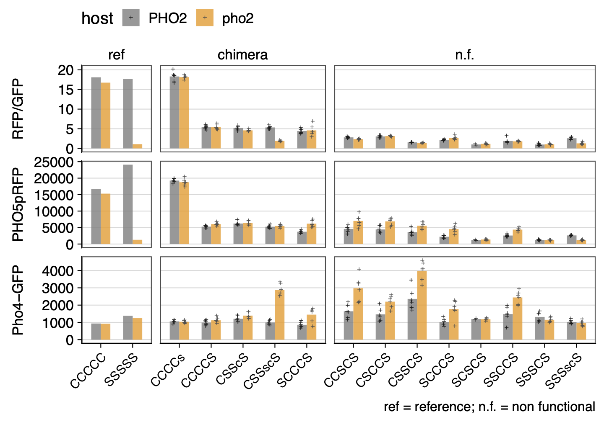

```{r message=FALSE}
require(plotly)
require(tidyverse)
require(ggridges)
require(cowplot)
require(ggtext)
require(RColorBrewer)
```

```{r}
old <- theme_set(theme_bw(base_size = 16))
```

# Background

Most of the chimeras in the main set with P2ID:Cg + DBD:Sc are non functional. To test the hypothesis that DBD:Sc requires P2ID:Sc to be active, Lindsey constructed a few of those non-functional chimeras, replacing DBD:Sc with a combined P2ID-DBD:Sc. In addition, three chimeras were made to test a different idea related to the same non functional set. This time, the test is to see if fusing a small stretch of residues that are predicted to be an extention of the basic region and part of the first alpha helix only in CgPho4 to DBD:Sc would rescue those chimeras. 
    
# Goal

-   Analyze the Sc45 and Cg4ext flow results.
-   Compare the new set of chimeras to the corresponding ones in the main set, to test specific hypotheses about P2ID-DBD:Sc is the functional unit, and if the alpha helix extension predicted in CgPho4 can rescue the non-functional P2ID:Cg + DBD:Sc chimeras

# Data

The flow data are collected between 2024.01.22-2024.01.29. The data are processed and saved in the `../input/PHO5/` folder. See README.md there for details.

Import the data

```{r}
files <- list.files(path = "../input/PHO5-data",
                    pattern = "202401.*-gated-median-out.txt")
names <- gsub("-gated-median-out.txt", "", files)
files <- paste0("../input/PHO5-data/", files)
names(files) <- names
raw <- map_dfr(files, ~read_tsv(.x, col_types = cols()), .id = "date") %>% 
  mutate(
    flag = ifelse(n_induction < 1000, "fail", "pass"), # fail if fewer than 1000 events
    date = format(ymd(date), "%m/%d")
  ) %>% 
  filter(!grepl("bead", sample)) %>% 
  separate(col = sample, sep = "-", into = c("plasmid", "host", "rep"))
```

Sample information

```{r}
sample <- read_tsv("../input/20240207-Sc45-Cg4ext-makeup.txt",
                   col_types = "ccccc", comment = "#")
```

# QC

## 1. Number of events per sample

Blank wells are indeed blank

```{r}
raw %>% filter(host == "blank") %>% 
  group_by(date) %>%
  ggplot(aes(x = date, y = n_cells)) + geom_point(aes(shape = well)) +
  stat_summary(fun.data = "mean_se", geom = "pointrange", color = "red", 
               position = position_nudge(x = 0.1)) +
  theme_bw(base_size = 16) + theme(axis.text.x = element_text(size = rel(0.8), angle = 90))
```

> there may be some carry over between wells. No wide spread contamination though.

Below, we will remove the blank wells from further consideration

```{r}
tmp <- filter(raw, host != "blank")
```

```{r}
tmp %>% 
  ggplot(aes(x = n_induction)) + 
  #geom_histogram(bins = 30, fill = "forestgreen") + facet_grid(host~date) + 
  geom_density_ridges(aes(y = date)) +
  facet_wrap(~host) + theme_minimal(base_size = 14) #+ panel_border()
```

> Nearly all of the experimental wells (not blank) have \> 5000 events,

```{r}
tmp %>% filter(n_induction < 1000)
```

Remove low event count and a few experiments with "fail" flag.

```{r}
dat <- filter(raw, host != "blank", flag == "pass")
```

## 2. Background subtraction

Check the background fluorescence levels across different days.

```{r}
dat %>% filter(host == "156") %>% 
  pivot_longer(BL1.H:nRFP, names_to = "parameter", values_to = "intensity") %>% 
  mutate(parameter = ordered(parameter, levels = c("BL1.H", "YL2.H", "nGFP", "nRFP"))) %>% 
  ggplot(aes(x = date, y = intensity)) + geom_point(aes(shape = well)) +
  stat_summary(fun.data = "mean_se", geom = "crossbar", color = "red") +#, 
               #position = position_nudge(x = 0.3)) +
  facet_wrap(~parameter) +
  theme_bw(base_size = 16) + theme(axis.text.x = element_text(size = rel(0.8), angle = 90))
```

> there is one sample on 1/22 with high background.

```{r}
tmp <- dat %>% filter(host == "156")
lm(BL1.H ~ date, data = tmp) %>% anova()
```

Subtract the background. I'll use the median value of the NA-156 samples as the background.

```{r}
bg <- dat %>% 
  filter(host == "156") %>% 
  group_by(date) %>% 
  # average based on dates
  summarize(across(BL1.H:nRFP, ~ round(median(.x),1)), .groups = "drop") %>% 
  # median of day averages
  summarize(across(BL1.H:nRFP, ~median(.))) %>% 
  unlist() # turn into a named vector storing background readings
  #column_to_rownames(var = "date")

bg.rm <- dat %>% 
  select(date:host, events = n_induction, FSC.H:nRFP, flag) %>%
  mutate(
    BL1.H = BL1.H - bg["BL1.H"],
    YL2.H = YL2.H - bg["YL2.H"],
    nGFP = nGFP - bg["nGFP"],
    nRFP = nRFP - bg["nRFP"],
    # rename the host column
    host = ordered(host, levels = c("555", "373", "156"), labels = c("PHO2", "pho2∆", "noRFP"))
  )
```

Double check that the subtraction worked correctly

```{r}
bg.rm %>% filter(host == "noRFP") %>% 
  pivot_longer(BL1.H:nRFP, names_to = "parameter", values_to = "intensity") %>% 
  mutate(parameter = ordered(parameter, levels = c("BL1.H", "YL2.H", "nGFP", "nRFP"))) %>% 
  ggplot(aes(x = date, y = intensity)) + geom_point(aes(shape = well)) +
  stat_summary(fun.data = "mean_se", geom = "pointrange", color = "red", position = position_nudge(x = 0.1)) +
  facet_wrap(~parameter, scale = "free_y") +
  theme_bw(base_size = 14) + theme(axis.text.x = element_text(angle = 90))
```

Determine if any sample had very low mNeon levels despite having a Pho4
chimera plasmid. I observed such samples when doing the pre-processing,
and would like to identify and remove them now.

```{r}
mycolors = c(brewer.pal(name="Paired", n = 8), brewer.pal(name="Dark2", n = 8))

no.exn.th <- 200
ggplot(bg.rm, aes(x = plasmid, y = abs(BL1.H))) +
  geom_hline(yintercept = no.exn.th, color = "grey50", linetype = 2, linewidth = 0.2) +
  geom_point(aes(color = date)) + 
  scale_y_log10(breaks = c(100, 1000, 10000)) + ylab("BL1.H") +
  scale_color_manual(values = mycolors) + theme_cowplot() +
  theme(axis.text.x = element_text(angle = 90, size = rel(0.6), vjust = 0.5),
        axis.text.y = element_text(size = rel(0.6)),
        axis.title = element_text(size = rel(0.9)),
        legend.text = element_text(size = rel(0.9)),
        legend.position = "top")
```
> 1. Several measurements for pH224 fell below the no expression threshold
> 2. A couple of no plasmid controls showed high expressions

```{r}
# assign "fail" to the non-expressing ones
bg.rm[bg.rm$plasmid != "NA" & bg.rm$BL1.H < no.exn.th, "flag"] = "no exn"
# assign "fail" to the no plasmid and yet high GFP ones
bg.rm[bg.rm$plasmid == "NA" & bg.rm$BL1.H > no.exn.th, "flag"] = "unexpect"
filter(bg.rm, flag != "pass") %>% arrange(plasmid)
```

> the above samples will be exported for archiving, but won't be used in
> subsequent analyses.


## 3. Reproducibility within and across experiments

Check the background-subtracted fluorescence values for the host strains
(yH373 and yH555) as well as the positive control strain (pH188 in yH373
or yH555 backgrounds), both of which are present on each plate.

```{r}
bg.rm %>% 
  filter(plasmid %in% c("188", "194", "NA"), host != "noRFP") %>% 
  pivot_longer(BL1.H:YL2.H, names_to = "parameter", values_to = "intensity") %>% 
  #mutate(parameter = ordered(parameter, levels = c("BL1.H", "YL2.H", "nGFP", "nRFP"))) %>% 
  ggplot(aes(x = plasmid, y = intensity, group = date)) + 
  geom_point(aes(color = date), position = position_dodge(0.7)) + 
  scale_color_manual(values = mycolors) +
  facet_grid(parameter~host, scale = "free_y") +
  theme_bw(base_size = 14)# +
  #theme(axis.text.x = element_text(face = 3))
```

> What's unusual this time is that there are some pH194 samples and a couple of
> no plasmid host strains showing very high GFP levels. Label them as "Fail"

```{r}
bg.rm[bg.rm$plasmid == "194" & bg.rm$BL1.H > 2000, "flag"] = "unexpect"
filter(bg.rm, plasmid != "NA", flag == "unexpect")
```

## 4. Well position effect

```{r}
tmp <- bg.rm %>% 
  filter(plasmid == "194", host == "PHO2", flag == "pass") %>% 
  separate(well, into = c("row", "col"), sep = 1) %>% 
  pivot_longer(BL1.H:YL2.H, names_to = "parameter", values_to = "intensity")

p0 <- list(
  geom_point(aes(color = date), size = 1), 
  #geom_line(aes(color = date), size = 0.4),
  stat_summary(aes(color = date), geom = "line", fun = mean, linewidth = 0.5),
  scale_color_manual(values = mycolors),
  #scale_color_brewer(type = "qual", palette = 2),
  facet_wrap(~parameter, scales = "free_y"),
  xlab(NULL),
  guides(color = guide_legend(title.position = "left", nrow = 2, byrow = TRUE)),
  theme_bw(base_size = 14),
  theme(legend.text = element_text(size = rel(0.8)))
)

p1 <- ggplot(tmp, aes(x = row, y = intensity, group = date)) + p0 +
  labs(subtitle = "Variation over rows")

p2 <- ggplot(tmp, aes(x = col, y = intensity, group = date)) + p0 +
  labs(subtitle = "Variation over columns")

p.legend <- get_legend(p1)

plot_grid(p1 + guides(color = "none"), p2 + guides(color = "none"), p.legend,
          nrow = 3, rel_heights = c(1,1,0.3))
```

> -   no obivous trend between the rows; there seems to be downward
>     trend for BL1 going from column 1 to 9
> -   a clear correlation between YL2.H and BL1.H. at least part of this
>     is due to the cell size differences -- see size normalized data
>     below:

-   What we care about is the ratio between Pho4-mNeon and
    *PHO5pr*-mCherry

```{r}
tmp <- bg.rm %>% 
  filter(plasmid == "194", host == "PHO2", flag == "pass") %>% 
  separate(well, into = c("row", "col"), sep = 1)

tmp %>% 
  ggplot(aes(x = BL1.H, y = YL2.H)) + 
  stat_smooth(aes(color = date, group = date), 
              method = "lm", formula = y ~ 0 + x, 
              se = FALSE, size = 0.5) +
  geom_point(aes(color = date, shape = col), size = 1.5) + 
  #scale_color_manual(values = mycolors) +
  scale_shape_manual(values = 17:19) +
  facet_wrap(~ date) +
  theme_minimal(base_size = 16) + 
  theme(axis.text = element_blank(),
        legend.position = "right",
        legend.box = "horizontal")
```

> Overall the ratio is rather reproducible, with 01/29 data showing a trend
> that is "flatter", likely showing some column effect.

Let's check both ScPho4 (pH194) and CgPho4 (pH188) to see if their
behaviors are consistent across the days.

```{r}
bg.rm %>% 
  filter(plasmid %in% c("188", "194"), flag == "pass") %>% 
  mutate(`YL2.H/BL1.H` = YL2.H/BL1.H,
         Pho4 = factor(plasmid, levels = c("194", "188"), 
                       labels = c("ScPho4", "CgPho4"))) %>% 
  separate(well, into = c("row", "col"), sep = 1) %>% 
  ggplot(aes(x = date, y = `YL2.H/BL1.H`)) + 
  geom_bar(aes(fill = host), stat = "summary", fun = "mean", 
           position = position_dodge(0.9)) +
  geom_point(aes(group = host), size = 1, shape = 3,
             position = position_dodge(width = 0.9)) + 
  scale_fill_manual(values = c("PHO2" = "gray60", "pho2∆" = "orange")) +
  #stat_summary(fun.data = "mean_se", geom = "pointrange", color = "red") +
  facet_grid(Pho4 ~ .) +
  theme_bw(base_size = 16) + background_grid(major = "none") +
  theme(axis.text.x = element_text(size = rel(.8), angle = 45, vjust = 0.5))
```

> Overall quite comparable

## 5. High variance samples

Summarize the background subtracted data by calculating the means and cv for each strain.

```{r}
cv <- bg.rm %>% 
  filter(flag == "pass", host != "noRFP") %>% 
  select(-nGFP, -nRFP) %>%
  pivot_longer(FSC.H:YL2.H, names_to = "parameter", values_to = "intensity") %>% 
  group_by(date, plasmid, host, parameter) %>% 
  summarize(
    n = n(),
    mean = mean(intensity),
    cv = sd(intensity)/mean(intensity),
    .groups = "drop"
  ) %>% 
  arrange(desc(cv))
```

Identify the high variance samples

```{r}
high.var.list <- cv %>% 
  mutate(CV = round(abs(cv), 3)) %>% 
  pivot_wider(id_cols = c(date, plasmid, host), 
              names_from = parameter, names_prefix = "CV_",
              values_from = CV) %>%
  filter(CV_BL1.H > 0.2 | CV_YL2.H > 0.2) %>% 
  arrange(date, plasmid, host)

dat.high.var <- left_join(high.var.list, bg.rm) %>% arrange(date, plasmid) 

#write_tsv(dat.high.var, "../input/PHO5-data/20240103-high-var-samples.tsv")

dat.high.var %>% filter((CV_BL1.H > 1 & plasmid != "NA") | CV_YL2.H > 1)
```
> Note that for pH437, the samples where BL1.H is higher than 5000 have a similar YL2.H. The situation is 
> different for pH436, where the one sample with a >5000 BL1.H also have a much higher YL2.H
> I will flag the first group (for pH437).

```{r}
bg.rm[bg.rm$plasmid == "437" & bg.rm$BL1.H > 5000, "flag"] = "unexpect"
```

## Summary and export

Number of replicates left for each sample

```{r, fig.width=10, fig.height=6}
expt <- bg.rm %>% 
  filter(host %in% c("PHO2", "pho2∆"), !plasmid %in% c("188", "194"), flag == "pass") %>% 
  group_by(date, plasmid, host) %>% 
  summarize(n = n(), .groups = "drop")

expt %>% 
  ggplot(aes(x = plasmid, y = n)) +
  geom_col(aes(fill = host)) + 
  facet_grid(date ~ .) +
  scale_fill_manual(values = c("PHO2" = "gray30", "pho2∆" = "gray70")) +
  theme_minimal() + background_grid(major = "none") + panel_border(size = 0.5) +
  scale_y_continuous(name = "Replicates", breaks = c(0, 3, 6)) + xlab(NULL) +
  theme(axis.text.x = element_text(angle = 90),
        legend.position = "top")
```

Export the background-subtracted values for later use with the shinyapp

```{r}
bg.rm %>% 
  # remove the yH156 samples
  filter(host != "noRFP") %>% 
  write_tsv("../input/20240210-Sc45-Cg4ext-subtracted-data.tsv")
```

# Analysis

## Analysis of previous results and hypothesis
Our earlier data and analysis revealed that most of the chimeras with P2ID:Cg + DBD:Sc are defective.



Two things jump out at us:

1. If we look at those chimeras that are majority CgPho4, such as CCCCS, SCCCS etc., these have very low activities with or without Pho2 compared with ScPho4 with Pho2.

    This result is contrary to our initial, naive expectation that DBD:Sc should function, perhaps slighly less active than DBD:Cg, on a CgPho4 background. This expectation is based on the assumption that 1) the DBD is modular and self-sufficient for its function and 2) we chose the breakpoint properly to ensure the modularity. Since the result is the opposite, one of the two assumptions must be wrong. The first one seems innocent, as modularity, especially when it comes to well characterized DBDs such as the bHLH, is well established. We have even done functional assays (BLI) on a DBD-only construct.
    
    Alternatively, it may be that we didn't choose the breakpoints properly, resulting in a nonfunctional DBD:Sc. Since our expression construct used for BLI is functional in the binding assay, I compared that one with our DBD:Sc in our main set. The expression construct included 7 additional amino acids. Note that in the P2ID:Cg + DBD:Sc chimeras, those 7 a.a. were not missing, just replaced by the counterparts from CgPho4. It turns out these 7 a.a. were fairly similar between the two: SLSKRRS vs SIGRVRS. So, how likely is it that differences in these positions were responsible for the problem? Furthermore, the crystal structure for DBD:Sc in Shimizu et al 1997 used an even shorter construct, starting from KRE... (251-312). This is also the construct used by Donovan et al 2023 (PMID: 36996811) both _in vitro_ and _in vivo_ for measuring naked and nucleosomal DNA binding. The Pho4∆N construct (250-312) was found to bind efficiently.
    
    So, it seems we have to find another answer. Since Donovan et al 2023 showed that Pho4∆N is able to bind DNA in vitro and in vivo, and even cause nucleosomal displacement (Fig. 5, note that the expression was controlled by a MET promoter, and is likely higher than native), it must be that the level of binding it provides is not sufficient for recruiting the necessary cofactors (general TFs for example) -- our assay is at the gene induction level after all.
    
    
    
2. Several P2ID:Cg+DBD:Sc chimeras have a **higher activity w/o Pho2 than ScPho4 does**.

    Note that such chimeras either have R1 or R3 from CgPho4, while R2 and R4 from CgPho4 by themselves seem to be unable to boost activity w/o Pho2. In light of the above, I hypothesize that DBD:Sc alone, without P2ID:Sc, has limited capability as an integral part of the TF (may be fine with respect to DBD function alone). On this background though, having R1 and R3 from CgPho4 could increase the activity without Pho2.
    
3. One chimera, CCCCs (Cg 1-470 Sc 251-312), shows the same activity levels as CgPho4.

    I wondered if the additional amino acids (459-470), which included a CgPho4-specific extension of the basic region, and as part of the helix, may play a crucial role. To test this, Lindsey constructed a few tester constructs, replacing the original 4/5 breakpoints for P2ID:Cg with aa 470.
    
## Compare Sc45 combo and Cg4 extension
The rationale of this experiment is to test whether putting P2ID:Sc back could not only rescue the activity of the chimeras with Pho2, but also boost the activity with Pho2, if **P2ID:Sc doesn't _actively_ inhibit DBD:Sc and is in fact required for its proper function**

Import the sample information
```{r}
meta <- read_tsv("../input/20240207-Sc45-Cg4ext-makeup.txt",
                 col_types = "ccccc", comment = "#")
```

... summarize the data
```{r}
dat1 <- bg.rm %>% 
  filter(plasmid != "NA", host != "noRFP", flag == "pass") %>% 
  mutate(host = fct_recode(host, pho2 = "pho2∆"))

datsum <- dat1 %>%
  group_by(plasmid, host) %>% 
  summarize(
     n = n(),
    mG = mean(BL1.H),
    mR = mean(YL2.H),
     A = mean(YL2.H/BL1.H),
     r = mR/mG,
    s2 = 1/(n-1)*sum((YL2.H - r*BL1.H)^2),
    vr = 1/(mG^2)*s2/n,
    se = sqrt(vr),
    .groups = "drop"
  ) %>% 
  select(-s2, -vr)
```

... merge the data for plotting
```{r}
ximera <- datsum %>%
  pivot_wider(id_cols = plasmid, names_from = host, values_from = A, names_prefix = "A_") %>% 
  mutate(
    s_PHO2 = A_PHO2 / A_PHO2[plasmid == "194"],
    s_pho2 = A_pho2 / A_pho2[plasmid == "194"],
    boost = A_PHO2 / A_pho2,
    group = case_when(
      plasmid %in% c("188", "194") ~ "ref",
      s_PHO2 < 0.2                 ~ "n.f.",
      .default = "chimera"
    ),
    group = fct_relevel(group, "ref", "chimera", "n.f.")
  ) %>% 
  left_join(select(meta, plasmid, set, symbol), by = "plasmid") %>% 
  mutate(symbol = fct_reorder(symbol, s_PHO2, .desc = TRUE)) %>% 
  relocate(c(set, symbol, group), .after = plasmid)
```

Export the summarized data
```{r}
write_tsv(ximera, file = "../output/20240212-Sc45-Cg4ext-chimera-summarized.tsv")
```

... source the plotting functions
```{r}
source("../script/20240211-chimera-data-plotting-functions.R")
```

Plotting the results
```{r, fig.width=8}
tmp <- ximera %>% 
  select(plasmid, symbol, group) %>% 
  inner_join(dat1, by = "plasmid") %>% 
  mutate(symbol = fct_relevel(symbol, sort),
         group = fct_recode(group, chimera = "n.f."))
my_plot_components(tmp)
```
> 1. Replacing DBD:Sc with the combination of P2ID+DBD:Sc rescued the activity with Pho2. This suggests that even though DBD:Sc have binding capabilities _in vitro_ and _in vivo_, its function in the context of the full TF protein requires P2ID:Sc and the presence of Pho2.
> 
>    It is worth noting that some of the chimeras exceeded the activity of both ScPho4 and CgPho4.
> 
> 2. There is very little change in the activity without Pho2. This is again consistent with the interpretation above, i.e., for full functionality of the TF, il faut le trio: P2ID:Sc + DBD:Sc + Pho2
>
> 3. Lindsey also tested if extending P2ID:Cg to a.a. 470 makes any difference. The answer is no.
