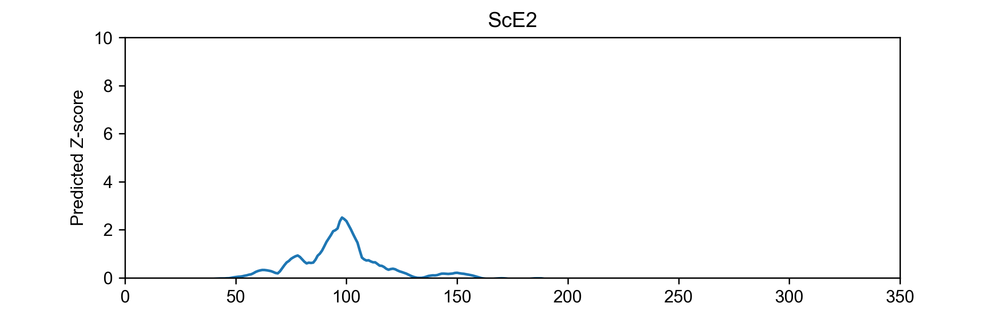

```{r setup, message=FALSE}
require(tidyverse)
require(cowplot)
require(broom)
set.seed(12345)
old <- theme_set(theme_cowplot())
```

# Goal

Plotting Y1H data for testing the activation potential of PADDLE predicted regions in both ScPho4 and CgPho4. One specific goal in this study is to determine whether any of their effect is Pho2-dependent.

# Data

Flow cytometry experiments were performed by Emily from 2024-10-30 to 2024-11-20. Gating was done on the Attune software and the stats were exported and organized

Note that in this dataset, R2 and R1 represent the cell and singlet gates, while R3 is the histogram gate to deal with some samples showing a bimodal distribution. In the analysis, Emily opted to use the singlet gate rather than the histogram gate. We can test both

```{r}
# read in sample information
sample <- read_tsv("../input/EO-Y1H-dep-Pho2-sample.tsv",
                   # this tells the function that it should expect two character columns
                   col_types = "cc", 
                   # this is to ensure if there are no values in some cell in the 
                   # spreadsheet file, they will be translated to NA 
                   na = character()) %>% 
  # this is to change the name and group into vectors. optional
  mutate(name = fct_inorder(name), group = fct_inorder(group))
# read in the raw data
raw <- bind_rows(
  `20241030` = read_tsv("../input/20241030-EO-Y1H-dep-Pho2-export.tsv", na = c("N/A", "")),
  `20241119` = read_csv("../input/20241119-EO-Y1H-dep-Pho2-export.csv", na = c("N/A", "")),
  `20241120` = read_csv("../input/20241120-EO-Y1H-dep-Pho2-export.csv", na = c("N/A", "")),
  `20241204` = read_csv("../input/20241204-EO-Y1H-dep-Pho2-export.csv", na = c("N/A", "")),
  `20241209` = read_csv("../input/20241209-EO-Y1H-dep-Pho2-export.csv", na = c("N/A", "")),
  .id = "Date"
)

# transform the raw data
dat <- raw %>% 
  # retain only the columns we need, and rename them for easy manipulation
  select(date = Date, sample = Sample, gate = Gate, par = `X Parameter`,
         count = Count, median = `X Median`) %>% 
  # remove bead controls
  filter(sample != "beads") %>% 
  # filter by X Parameter and gates
  # we will retain both R1 and R3 gated cells for later experimenting
  filter(gate %in% c("R1", "R3"), par == "PHO5pr-mCherry - YL2-H") %>% 
  # here, we separate the sample name into its constituent parts by "-":
  # 1. plasmid name; 2: host name; 3: replicate name
  separate(sample, into = c("plasmid", "host", "rep"), sep = "-") %>% 
  # rename the host levels
  mutate(host = fct_recode(host,
                           PHO2 = "696", pho2 = "1009", 'pho2*' = "1009a")) %>% 
  # here, we annotate the raw data by merging it with the sample information
  # sheet, joining on the common column, i.e., plasmid
  left_join(sample, by = "plasmid")
```

Some data quality check

Any sample with fewer than 2500 events?

- In the R1 gate
```{r}
dat %>% filter(count < 2500, gate == "R1")
```

- In the R3 gate
```{r}
dat %>% filter(count < 2500, gate == "R3")
```
Many samples seem to have few events in the histogram gate - this is understandable as the gate was created to isolate the "high expression" population from bimodally distributed samples. The R3 gate would include few events for samples where the reporter is not "on".

Are negative controls negative?
- blank wells
```{r}
dat %>% filter(host == "blank") %>% arrange(gate)
```

- no plasmid host background
```{r}
dat %>% 
  filter(host != "blank", plasmid == "NA", gate == "R1") %>% 
  arrange(host, date)
```
All seems good. Can proceed with plotting. Blank wells will be omitted from plotting.

# Plot data
set some plotting variables
```{r}
# set the host levels for renaming them later
host.levels <- c("696" = "PHO2", "1009" = "pho2", "1009a" = "pho2*")

# set host colors
host.colors <- c("PHO2" = "gray50", "pho2" = "orange", "pho2*" = "orange3", 
                 "blank" = "gray90")

# set group colors
grp.colors <- c("control" = "gray50", 
                "ScPho4" = rgb(56, 118, 29, maxColorValue = 255), 
                "CgPho4" = rgb(40, 130, 200, maxColorValue = 255),
                "Combo" = rgb(142, 120, 200, maxColorValue = 255))

# set position for bar plots
pd <- position_dodge(0.75)
```
reformat and subset the data, normalizing by the no plasmid control
```{r}
dat1 <- dat %>% 
  # use R1 gate, remove the blank wells and samples with low event number
  filter(host != "blank", gate == "R1", count > 2500) %>%
  # all constructs 
  # CgE2_9aa:ScAD_9aa was only tested in the pho2 background on 10/30, remove
  # so data is paired on each day
  filter(!(date == "20241030" & plasmid == "391")) %>% 
  # Constructs containing CgE1 had overall much lower activity on 12/04
  # note that leaving this set of data in doesn't change the conclusions
  filter(!(grepl("CgE1", name) & date == "20241204")) %>% 
  # normalize by the host no plasmid control on separate days
  group_by(host, date) %>% 
  mutate(median = median / mean(median[name == "host"])) %>% 
  ungroup() 
```

## Plot with days distinguished by color
Plot data without Gal4 full length and with different dates colored differently
```{r}
my_plot_design <- list(
  geom_bar(aes(fill = host), width = 0.75,
           stat = "summary", fun = "mean", position = pd),
  stat_summary(fun.data = "mean_sdl", fun.args = list(mult = 1), 
              geom = "linerange", color = "gray30", linewidth = 0.5,
              position = pd),
  #geom_point(aes(color = date), position = pd, size = 0.75),
  scale_x_discrete(limits = rev),
  coord_flip(),
  scale_fill_manual(values = host.colors),
  scale_color_brewer(palette = "Set1"),
  ylab("Normalized activity"),
  xlab(NULL),
  theme_cowplot(),
  panel_border(color = "gray20", size = 1.2),
  background_grid(major = "x", minor = "x"),
  theme(
    axis.line = element_blank(),
    legend.text = element_text(face = 3)
  )
)
```

```{r}
p0 <- dat1 %>% 
  # exclude pho2 alternative transformant from the plot
  filter(host != "pho2*") %>% 
  # exclude Gal4 full length from the plot
  filter(name != "Gal4") %>% 
  # reorder the levels of the host for plotting
  mutate(host = fct_relevel(host, "pho2", "pho2*", "PHO2")) %>% 
  ggplot(aes(x = name, y = median, group = host)) + my_plot_design +
  geom_point(aes(color = date), position = pd, size = 0.75)
p0
ggsave("../output/20241202-EO-Y1H-Pho2-dep-plot-date-separate.png", width = 6, height = 8)
```

Plot data for Gal4 full length with controls different dates colored differently
```{r}
p0 <- dat1 %>% 
  # exclude pho2 alternative transformant from the plot
  filter(host != "pho2*") %>% 
  # just include Gal4 full length and the controls
  filter(group == "control") %>% 
  # reorder the levels of the host for plotting
  mutate(host = fct_relevel(host, "pho2", "pho2*", "PHO2")) %>% 
  ggplot(aes(x = name, y = median, group = host)) + my_plot_design +
  geom_point(aes(color = date), position = pd, size = 0.75)
p0
ggsave("../output/20241202-EO-Y1H-Pho2-dep-plot-controls-date-separate.png", width = 6, height = 3)
```

## Plot without days distinguished
Plot data without Gal4 full length
```{r}
p0 <- dat1 %>% 
  # exclude pho2 alternative transformant from the plot
  filter(host != "pho2*") %>% 
  # exclude Gal4 full length from the plot
  filter(name != "Gal4") %>% 
  # reorder the levels of the host for plotting
  mutate(host = fct_relevel(host, "pho2", "pho2*", "PHO2")) %>% 
  ggplot(aes(x = name, y = median, group = host)) + my_plot_design +
  geom_point(position = pd, size = 0.5, color = "gray70")
p0
ggsave("../output/20241202-EO-Y1H-Pho2-dep-plot.png", width = 6, height = 8)
```

Plot data for Gal4 full length with controls different dates colored differently
```{r}
p0 <- dat1 %>% 
  # exclude pho2 alternative transformant from the plot
  filter(host != "pho2*") %>% 
  # just include Gal4 full length and the controls
  filter(group == "control") %>% 
  # reorder the levels of the host for plotting
  mutate(host = fct_relevel(host, "pho2", "pho2*", "PHO2")) %>% 
  ggplot(aes(x = name, y = median, group = host)) + my_plot_design +
  geom_point(position = pd, size = 0.75)
p0
ggsave("../output/20241202-EO-Y1H-Pho2-dep-plot-controls.png", width = 6, height = 3)
```

Plot data without full length Gal4 and also without ScE2 constructs, which we didn't test in our first submission. This figure is used in the response to the reviewers' comments.
```{r}
p0 <- dat1 %>% 
  # exclude pho2 alternative transformant from the plot
  filter(host != "pho2*") %>% 
  # exclude Gal4 full length from the plot
  filter(name != "Gal4") %>% 
  # exclude ScE2 plasmid
  filter(!grepl("ScE2", name)) %>% 
  # reorder the levels of the host for plotting
  mutate(host = fct_relevel(host, "pho2", "pho2*", "PHO2")) %>% 
  ggplot(aes(x = name, y = median, group = host)) + my_plot_design +
  geom_point(position = pd, size = 0.5, color = "gray70")
p0
ggsave("../output/20241215-EO-Y1H-Pho2-dep-plot-noScE2.png", width = 6, height = 7.5)
```
# Statistical analyses
## Pho2-dependence
For each of the tested constructs, test for Pho2-dependence
```{r}
dat1 %>% 
  filter(host != "pho2*") %>% 
  select(name, host, median) %>% 
  nest(data = -name) %>% 
  mutate(test = map(data, \(x) t.test(median ~ host, data = x)),
         tidied = map(test, tidy)) %>% 
  unnest(tidied) %>%
  select(sample = name, dA = estimate, statistic, p.value) %>% 
  mutate(P.adj = p.adjust(p.value, method = "holm")) %>% 
  arrange(P.adj)
```
> Only the ScE2 tested significant at a 0.05 level after Bonferronni-Holm correction for a Pho2 dependent effect.

If leaving out ScE2 constructs
```{r}
dat1 %>% 
  filter(host != "pho2*") %>% 
  filter(!grepl("ScE2", name)) %>% 
  select(name, host, median) %>% 
  nest(data = -name) %>% 
  mutate(test = map(data, \(x) t.test(median ~ host, data = x)),
         tidied = map(test, tidy)) %>% 
  unnest(tidied) %>%
  select(sample = name, dA = estimate, statistic, p.value) %>% 
  mutate(P.adj = p.adjust(p.value, method = "holm")) %>% 
  arrange(P.adj)
```
## CgE1
Constructs containing CgE1 showed a consistent pattern of a higher activity with than without Pho2. Different from ScE2, we still see a boosting effect from CgE1 without Pho2. We will be testing this formally here. The goal is to compare the CgE1-containing constructs to the paired AD-only ones.
```{r}
# paired with ScAD_9aa
grp <- c("ScAD_9aa", "CgE1:ScAD_9aa", "ScAD_9aa:CgE1")
tmp <- dat1 %>% 
  filter(name %in% grp, host == "pho2") %>% 
  mutate(name = fct_relevel(name, !!!grp))
lm(median ~ name, tmp) |> summary()
```

```{r}
# paired with CgAD
grp <- c("CgAD", "CgE1:CgAD", "CgAD:CgE1")
tmp <- dat1 %>% 
  filter(name %in% grp, host == "pho2") %>% 
  mutate(name = fct_relevel(name, !!!grp))
lm(median ~ name, tmp) |> summary()
```

## ScE2
One of the intriguing new results Emily generated was the effect of ScE2. This region wasn't predicted to have activation potential

> the small peak was the Gal4DBD in the plasmid. E2 region was flat.

However, Emily's new data showed that ScE2 can boost the activity of ScAD in a Pho2-dependent manner. Moreover, it seems that in the absence of Pho2, it can _suppress_ ScAD! We will test this statistically here.

First, its boosting effect.
```{r}
grp <- c("ScAD", "ScAD:ScE2", "ScE2:ScAD")
tmp <- dat1 %>% 
  filter(name %in% grp, host == "PHO2") %>% 
  mutate(name = fct_relevel(name, !!!grp))
lm(median ~ name, tmp) |> summary()

```
> note that there is some evidence for orientation dependency: ScE2 has a much stronger effect when it is on the C-terminus of the ScAD than when it was placed at the N-terminus.

Next, its suppressive effect
```{r}
grp <- c("ScAD", "ScAD:ScE2", "ScE2:ScAD")
tmp <- dat1 %>% 
  filter(name %in% grp, host == "pho2") %>% 
  mutate(name = fct_relevel(name, !!!grp))
lm(median ~ name, tmp) |> summary()
```

